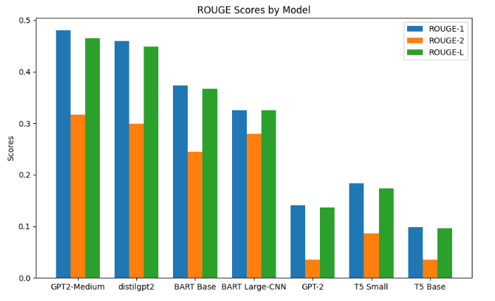
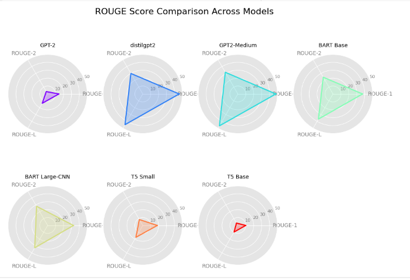
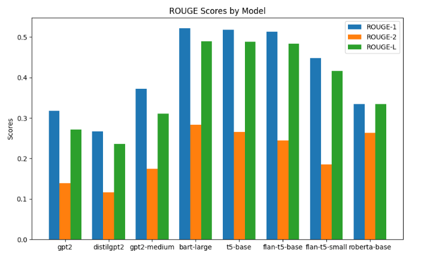
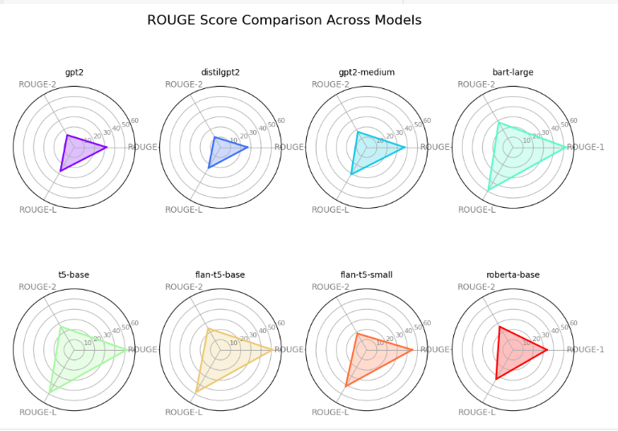
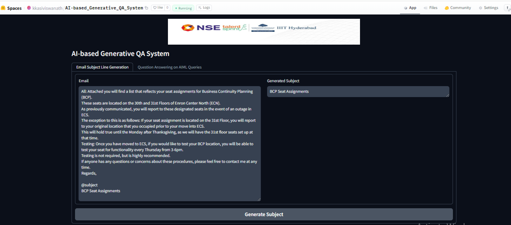
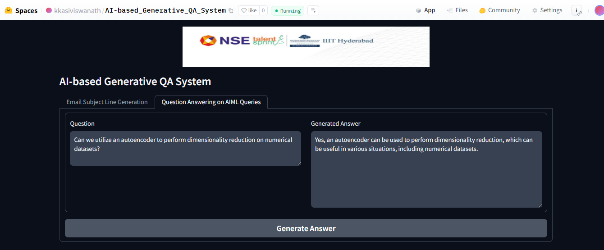
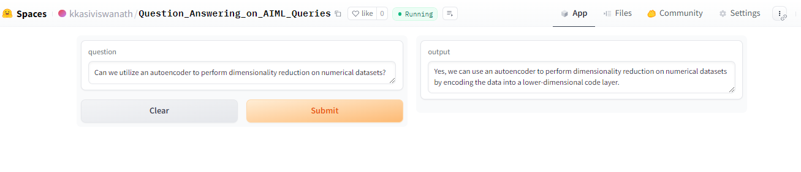
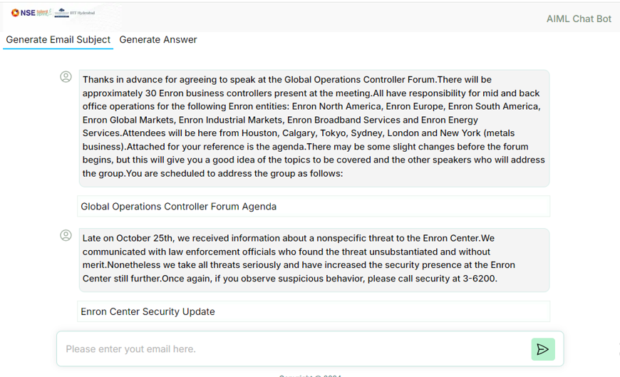
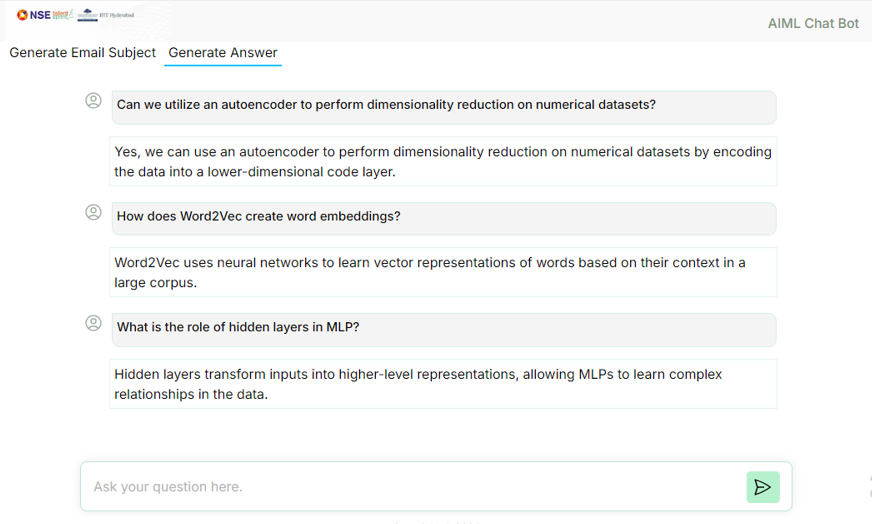

# Project Title: AI-based Generative QA System

## Table of Contents


1. [Objective](#objective)
2. [Project Overview](#project-overview)
   - [Email Subject Line Generation](#email-subject-line-generation)
   - [Question Answering on AIML Queries](#question-answering-on-aiml-queries)
3. [Datasets Preparation](#datasets-preparation)
   - [Email Subject Line Generation](#1-email-subject-line-generation)
   - [Question Answering on AIML Queries](#2-question-answering-on-aiml-queries)
4. [Preprocessing Steps](#preprocessing-steps)
   - [Task 1: Email Subject Line Generation](#preprocessing-steps-for-task-1-email-subject-line-generation)
   - [Task 2: Question Answering on AIML Queries](#preprocessing-steps-for-task-2-question-answering-on-aiml-queries)
5. [Training Steps](#training-steps)
   - [Task 1: Email Subject Line Generation](#training-steps-for-task-1-email-subject-line-generation)
   - [Task 2: Question Answering on AIML Queries](#training-steps-for-task-2-question-answering-on-aiml-queries)
6. [Model Evaluation](#model-evaluation)
   - [ROUGE Scores for Task 1: Email Subject Line Generation](#rouge-scores-for-task-1-email-subject-line-generation)
   - [ROUGE Scores for Task 2: Question Answering on AIML Queries](#rouge-scores-for-task-2-question-answering-on-aiml-queries)
7. [Output for Few Emails](#output-for-few-emails-for-task-1-email-subject-line-generation)
8. [Answers for Few Questions](#answers-for-few-questions-for-task-2-question-answering-on-aiml-queries)
9. [Project Presentation](#project-presentation)
10. [Deployment Links](#deployment-links)
    - [Hugging Face Gradio Project Deployment](#huggingface-spaces-for-ai-based-generative-qa-system)
    - [Hugging Face Gradio Deployment for Task 1](#huggingface-spaces-for-task-1-email-subject-line-generation)
    - [Hugging Face Gradio Deployment for Task 2](#huggingface-spaces-for-task-2-question-answering-on-aiml-queries)
    - [Project API (FastAPI)](#project-api-fastapi)
    - [Project GUI (Nextjs)](#project-gui-nextjs)
11. [ROUGE Scores Explanation](#rouge-scores-explanation)
12. [Model Information](#model-information)
13. [Group Details](#group-details)

## Objective
1. Fine-tune a GPT variant model to generate succinct email subjects from email bodies.
2. Develop a QA system to generate answers to AIML-related questions.


## Project Overview
The project aims to provide hands-on experience with generative text systems through two main tasks:

1. **Email Subject Generation:** 
   - Fine-tune a GPT model using a prepared dataset.
   - Generate succinct email subjects from email bodies.
   - **Additional Learning:** Explore and compare other LLM models such as BERT, T5, and BART to understand their performance in email subject generation. Learn from different architectures to enhance the effectiveness of the GPT model.

2. **AIML Question Answering:**
   - Create a new dataset for AIML questions.
   - Fine-tune a GPT model to generate answers to these questions.
   - **Additional Learning:** Investigate other LLM models like T5, BERT, and BART for question answering. Compare their results to gain insights into their strengths and weaknesses in handling AIML queries.


## 1. Email Subject Line Generation

This task involves creating extremely short and concise email subjects, which is unique compared to tasks like news summarization or headline generation. The goal is to extract the most important sentences from the email body and condense them into a brief subject line.

**Key Aspects:**
- **Uniqueness:** The challenge lies in generating very brief summaries by focusing on the most salient information from the email body.
- **Implementation:** Utilize any GPT-2 variant to address the task, providing hands-on experience with generative models in NLP.
- **Evaluation:** Analyze and apply various metrics to evaluate the quality and effectiveness of the generated text.

This task offers a chance to delve into generative models, learn about their application in creating concise email subject lines, and understand different evaluation methods for text generation.


## 2. Question Answering on AIML Queries

Building on the experience gained from the first task, this task focuses on developing a domain-specific GPT variant model to answer questions related to the AIML course. Pretrained models often perform well on general tasks but may struggle with domain-specific queries. To address this, the model needs to be fine-tuned on a dataset specifically tailored to AIML topics.

**Key Aspects:**
- **Domain-Specific Modeling:** Fine-tune a GPT variant model to improve its ability to handle AIML-related questions.
- **Dataset Creation:** Collaborate to build a relevant dataset specifically for AIML questions.
- **Performance Evaluation:** Assess the model's effectiveness by testing it on new, unseen AIML queries.

This task provides an opportunity to refine model finetuning techniques, develop domain-specific datasets, and evaluate the model’s performance in answering specialized questions.


## Datasets Preparation

#### 1. Email Subject Line Generation
- **Dataset:** [Annotated Enron Subject Line Corpus](https://github.com/ryanzhumich/AESLC)
- **Description:**
  - **Content:** This dataset includes a subset of cleaned, filtered, and deduplicated emails from the Enron Email Corpus, featuring employee inboxes from the Enron Corporation.
  - **Evaluation Split:** The development and test sets each have 3 annotated subject lines per email by human annotators. This approach provides multiple reference points, as there isn't always one unique, appropriate subject line per email.
  - **Statistics:**
    - **Train/Dev/Test Splits:** 14,436 / 1,960 / 1,906
    - **Average Email Length:** 75 words
    - **Average Subject Length:** 4 words

#### 2. Question Answering on AIML Queries
- **Dataset:** [AIML QA Corpus](./question-answering/datasets/)
- **Description:**
  - **Creation:** This dataset will be curated collaboratively by all teams participating in the AIML course's NLP projects.
  - **Content:** Each team will contribute by answering a question bank of 250 questions, providing short 1-2 line answers which will be compiled into a CSV file.
  - **Source:** Questions will be drawn from the AIML course material covered in lectures.
  - **Deadline:** The dataset needs to be completed within 1 month of the project start date to allow enough time for QA model fine-tuning.
  - **Post-Creation:** After dataset completion, a common train/dev/test split will be provided for further experimentation with the QA model.

These datasets are essential for fine-tuning and evaluating the models for their respective tasks, providing a solid foundation for the project.

## Preprocessing Steps

### Preprocessing Steps for Task 1: Email Subject Line Generation

1. **Dataset Cloning**  
   The dataset for this task, **The Annotated Enron Subject Line Corpus**, is sourced from a public GitHub repository. To begin, the repository is cloned, and separate paths are defined for training, validation, and testing data.

2. **Training Data Preprocessing**  
   - Each file in the training dataset contains an email body and its corresponding subject line.
   - The files are read, and the content is split into two parts: the **Email Body** and the **Subject Line**.
   - A **DataFrame** is created to store these pairs for further use in model training.

3. **Validation Data Preprocessing**  
   - The validation dataset contains additional **annotations** for each email, apart from the email body and subject.
   - Files are processed by splitting the content into the **Email Body**, **Subject Line**, and three human-labeled annotations (**Ann0**, **Ann1**, **Ann2**).
   - A separate **DataFrame** is created for this, ensuring the annotations are mapped correctly for evaluation purposes.

4. **Test Data Preprocessing**  
   - The test dataset is similar to the validation dataset in structure, with each file containing the **Email Body**, **Subject Line**, and three annotations (**Ann0**, **Ann1**, **Ann2**).
   - The data is processed similarly, and a final **DataFrame** is created to hold the test data.

5. **Final Output**  
   Once preprocessing is completed, we have three DataFrames:
   - **Train DataFrame** containing emails and their corresponding subjects.
   - **Validation DataFrame** with emails, subjects, and three additional annotations for model evaluation.
   - **Test DataFrame** structured like the validation set, used for final performance testing.

These steps ensure the dataset is clean, structured, and ready for training the GPT model to generate concise email subject lines.

For the full preprocessing code, refer to the [Preprocessing Notebook](https://github.com/viswa3024/aiml-capstone-project-email/blob/main/email-subject/pre-process/email_subject_pre_process_v1.ipynb).


### Preprocessing Steps for Task 2: Question Answering on AIML Queries

1. **Dataset Preparation**  
   The dataset for the second task is created collectively by teams as part of the AIML course. The dataset consists of questions related to AIML concepts with short, concise answers. The dataset is split into **train**, **dev**, and **test** sets.

2. **Loading Training Data**  
   - The **training data** is loaded from a CSV file (`train.csv`).
   - This file contains AIML-related questions and their corresponding short answers.

3. **Loading Validation Data**  
   - The **validation data** is loaded from a separate CSV file (`dev.csv`).
   - This file follows the same structure as the training data and is used for model validation during fine-tuning.

4. **Loading Test Data**  
   - The **test data** is similarly loaded from another CSV file (`test.csv`).
   - This data is used to evaluate the final performance of the model on unseen AIML questions.

5. **Final Output**  
   After loading, the datasets are organized into **train**, **dev**, and **test** DataFrames, which are then used to fine-tune and evaluate the GPT model for AIML question answering.

These preprocessing steps prepare the data for modeling and evaluation in the task of AIML question answering.

For the full preprocessing code, refer to the [Preprocessing Notebook](./question-answering/pre-process).

## Training Steps

### Training Steps for Task 1: Email Subject Line Generation

1. **Dataset Loading:**
   - The training, validation, and testing datasets (`train.csv`, `val.csv`, and `test.csv`) were loaded into pandas DataFrames for further processing.

2. **Model Selection and Tokenizer Initialization:**
   - Multiple models were explored for this task:
     - **GPT-2:** A transformer-based model for text generation.
     - **DistilGPT2:** A smaller variant of GPT-2, fine-tuned for email subject generation.
     - **GPT2-Medium:** A larger variant of GPT-2 with more parameters.
     - **BART-base and BART-large-CNN:** Transformer models pre-trained for summarization.
     - **T5-base and T5-small:** Sequence-to-sequence models designed to generate concise outputs.
   - Tokenizers corresponding to each model were initialized with special tokens like `bos_token`, `eos_token`, `pad_token`, and `sep_token`.

3. **Dataset Preparation:**
   - A custom dataset class was implemented to tokenize emails and their corresponding subjects. For each email, the dataset class generated tokenized input IDs and attention masks with padding/truncation up to a maximum length of 250 tokens.
   - Different dataset classes were created for training, validation, and testing datasets.

4. **Model Training Setup:**
   - Training parameters were defined using Hugging Face’s `TrainingArguments`. These included:
     - Number of training epochs (15).
     - Batch sizes (8 for training, 16 for evaluation).
     - Evaluation strategy (evaluating at the end of every epoch).
     - Gradient accumulation, checkpointing, and learning rate scheduling.
     - The best model was selected based on the **ROUGE-L** metric.

5. **Metrics Computation:**
   - **ROUGE** was used to evaluate the model by comparing generated subject lines with reference subject lines. The following ROUGE variants were computed:
     - **ROUGE-1**: Measures overlap of unigrams (single words).
     - **ROUGE-2**: Measures overlap of bigrams (two consecutive words).
     - **ROUGE-L**: Measures the longest common subsequence (LCS) between the generated and reference texts.

6. **Model Training:**
   - The model was trained using the prepared datasets and Hugging Face's `Trainer` API. During training, the model generated candidate subject lines and evaluated them against reference annotations.

7. **Evaluation and Testing:**
   - The trained model was tested on unseen data using the test dataset. The model generated subject lines based on the email bodies.
   - The final predictions were evaluated using the **ROUGE** metrics and saved to a CSV file.

8. **Multiple Model Testing:**
   - The following models were tested:
     - **GPT-2**
     - **DistilGPT2**
     - **GPT2-Medium**
     - **BART-base**
     - **BART-large-CNN**
     - **T5-base**
     - **T5-small**

   The **ROUGE** scores achieved by these models are:

   ### ROUGE Scores:

   | Model            | ROUGE-1                | ROUGE-2                | ROUGE-L                |
   |------------------|------------------------|------------------------|------------------------|
   | GPT-2            | 0.1409                 | 0.0353                 | 0.1361                 |
   | DistilGPT2       | 0.4598                 | 0.2991                 | 0.4485                 |
   | GPT2-Medium      | 0.4799                 | 0.3165                 | 0.4652                 |
   | BART Base        | 0.3738                 | 0.2444                 | 0.3665                 |
   | BART Large-CNN   | 0.3257                 | 0.2800                 | 0.3257                 |
   | T5 Small         | 0.1835                 | 0.0866                 | 0.1732                 |
   | T5 Base          | 0.0985                 | 0.0353                 | 0.0959                 |

For detailed code, please refer to the [fine-tuned models](./email-subject).

### Model Test with Zero Shot Inferencing

Zero-shot inferencing allows machine learning models to perform tasks without task-specific training, leveraging pre-trained knowledge to handle tasks like text classification, translation, and question answering. This approach saves time and resources, making it ideal for applications where labeled data is scarce or impractical to obtain.

Several models were loaded directly from Hugging Face and random records were inferenced to see how the models were behaving.

**Models Tested:**
- **GPT-2**
- **T5-small**
- **T5-Base**
- **BART-base**
- **BART-large-CNN**

**Example:**

```python
    pipe = pipeline("summarization", model="facebook/bart-large-cnn")

    email_body = df['email_body'].iloc[0]
    subject_line = df['subject_line'].iloc[0]

    input_tokens = pipeline.tokenizer(email_body, return_tensors='pt')
    input_length = input_tokens['input_ids'].shape[1]
    adjusted_max_length = max(min_length + 10, int(input_length * 0.6))  
    min_length=3
    length_penalty=2.0 
    num_beams=4
        
    gen_kwargs = {
        "length_penalty": length_penalty,
        "num_beams": num_beams,
        "max_length": adjusted_max_length,
        "min_length": min_length
    }

    summary = pipe(email_body, **gen_kwargs)[0]['summary_text']
    print(summary)

```

```
Email Body: You have received this message because someone has attempted to send you an email from outside of Enron with an attachment type that Enron does not allow into our messaging environment Your email has been quarantined and is being held at the MailSweeper server Sender sloggansahmassoccom

Subject Line: An Inbound Message For You Has Been Quarantined

Generated Summary: Your email has been quarantined and is being held at the MailSweeper server Sender sloggansahmassoccom.

```

### Fine-Tuned Model Push to Hugging Face Repo
The fine-tuned model was pushed to the Hugging Face model hub for sharing and deployment.

**Example:**

```python
    repo_name="bart_email_subject_text_summarizer"

    model.push_to_hub(repo_name)
    tokenizer.push_to_hub(repo_name)

```

**Reference**: [bart_email_subject_summarizer on Hugging Face](https://huggingface.co/kkasiviswanath/bart_summarizer_deploy_v1)

### Test with Fine tuned model
The fine-tuned model was tested to validate its performance using the same setup

```python

    model_name = "bart_email_subject_text_summarizer"
    tokenizer = AutoTokenizer.from_pretrained(model_name)
    model = AutoModelForSeq2SeqLM.from_pretrained(model_name)

    pre_trained_model_pipe = pipeline("summarization", model="bart_email_subject_text_summarizer")

    email_body = df['email_body'].iloc[0]
    subject_line = df['subject_line'].iloc[0]

    input_tokens = pipeline.tokenizer(email_body, return_tensors='pt')
    input_length = input_tokens['input_ids'].shape[1]
    adjusted_max_length = max(min_length + 10, int(input_length * 0.6))  
    min_length=3
    length_penalty=2.0 
    num_beams=4
        
    gen_kwargs = {
        "length_penalty": length_penalty,
        "num_beams": num_beams,
        "max_length": adjusted_max_length,
        "min_length": min_length
    }

    summary = pre_trained_model_pipe(email_body, **gen_kwargs)[0]['summary_text']
    print(summary)

```

```
Email Body: Attached is a memo from Julia about a meeting going over some of the deals including power deals that were closed last year Background information on the deals could be helpful as several of these deals are likely to be administered by power trading Let LindaNoske know if you can make it lunch will be served


Subject Line: Finance meeting on structured deals


Generated Summary: Meeting to Discuss Power Trading Deals

```

### Training Steps for Task 2: Question Answering on AIML Queries

1. **Dataset Loading:**
   - The training, validation, and testing datasets (`train.csv`, `dev.csv`, and `test.csv`) were loaded into pandas DataFrames for further processing.

2. **Model Selection and Tokenizer Initialization:**
   - Multiple models were explored for this task:
     - **GPT-2:** A transformer-based model for text generation.
     - **DistilGPT2:** A smaller variant of GPT-2, fine-tuned for question-answering.
     - **GPT-2 Medium:** A larger variant of GPT-2 with more parameters.
     - **BART-large:** A transformer model pre-trained for summarization and question-answering.
     - **T5-base:** A model designed for text generation tasks, including question-answering.
     - **Flan-T5-base:** A variant of T5 with additional training for improved performance.
     - **Flan-T5-small:** A smaller variant of Flan-T5.
     - **RoBERTa-base:** A robustly optimized BERT model for improved performance in various NLP tasks.
   - Tokenizers corresponding to each model were initialized, including any special tokens necessary for question-answering tasks.

3. **Dataset Preparation:**
   - A custom dataset class was implemented to tokenize questions and their corresponding answers. The dataset class generated tokenized input IDs and attention masks, with padding/truncation up to a maximum length of 512 tokens.
   - Separate dataset classes were created for training, validation, and testing datasets to handle each dataset's unique format.

4. **Model Training Setup:**
   - Training parameters were defined using Hugging Face’s `TrainingArguments`. These included:
     - Number of training epochs (set based on validation performance).
     - Batch sizes (configured to balance memory usage and performance).
     - Evaluation strategy (e.g., evaluating at the end of every epoch).
     - Gradient accumulation, checkpointing, and learning rate scheduling.
     - The best model was selected based on performance metrics such as BLEU, ROUGE, and METEOR.

5. **Metrics Computation:**
   - **BLEU:** Measures the precision of n-grams in generated answers compared to reference answers.
   - **ROUGE:** Evaluates recall and overlap of n-grams between generated and reference answers.
   - **METEOR:** Measures alignment of generated answers with reference answers based on synonyms and stemming.

6. **Model Training:**
   - The model was trained using the prepared datasets and Hugging Face's `Trainer` API. During training, the model generated answers and evaluated them against reference annotations.

7. **Evaluation and Testing:**
   - The trained model was tested on unseen data using the test dataset. The model generated answers based on the questions provided.
   - The final predictions were evaluated using BLEU, ROUGE, and METEOR metrics and saved to a CSV file.

8. **Multiple Model Testing:**
   - The following models were tested:
     - **GPT-2**
     - **DistilGPT2**
     - **GPT-2 Medium**
     - **BART-large**
     - **T5-base**
     - **Flan-T5-base**
     - **Flan-T5-small**
     - **RoBERTa-base**

   The ROUGE scores achieved by these models are summarized as follows:

   ### ROUGE Scores:

| Model            | ROUGE-1                | ROUGE-2                | ROUGE-L                |
|------------------|-------------------------|-------------------------|-------------------------|
| gpt2             | 0.3183                  | 0.1386                  | 0.2713                  |
| distilgpt2       | 0.2665                  | 0.1163                  | 0.2363                  |
| gpt2-medium      | 0.3728                  | 0.1749                  | 0.3103                  |
| bart-large       | 0.5213                  | 0.2832                  | 0.4892                  |
| t5-base          | 0.5180                  | 0.2653                  | 0.4888                  |
| flan-t5-base     | 0.5128                  | 0.2448                  | 0.4832                  |
| flan-t5-small    | 0.4484                  | 0.1855                  | 0.4157                  |
| roberta-base     | 0.3340                  | 0.2638                  | 0.3340                  |

   For detailed code, please refer to the [fine-tuned models](./question-answering).

### Model Test with Zero-Shot Inferencing

Several models were loaded directly from Hugging Face and random records were inferenced to evaluate their performance.

**Models Tested:**
- **GPT-2**
- **DistilGPT2**
- **GPT-2 Medium**
- **BART-large**
- **T5-base**
- **Flan-T5-base**
- **Flan-T5-small**
- **RoBERTa-base**

**Example:**

```python
from transformers import pipeline

gpt2_medium_qa_pipeline = pipeline('text-generation', model='gpt2-medium')

def clean_generated_answer(answer):
    text = answer[0]['generated_text'].strip()
    cleaned_text = text.replace('\n\n', ' ').replace('\n', ' ')
    return cleaned_text

# Example usage
question = "Can we utilize an autoencoder to perform dimensionality reduction on numerical datasets?"
answer = generate_answer_with_pipeline(question, gpt2_medium_qa_pipeline)
print("Generated Answer:", answer)

```

```
Question: Can we utilize an autoencoder to perform dimensionality reduction on numerical datasets?


Answer1: Yes, autoencoders can be applied to numerical datasets for dimensionality reduction by learning a compressed input data representation. They can effectively capture nonlinear relationships and efficiently reduce the dimensionality.

Answer2: Yes, autoencoders can be used for dimensionality reduction. By training the autoencoder, it learns a compressed representation of the input data, allowing for a lower-dimensional representation that retains important features.


Generated Answer: Concatenation: A concatenation is a sequence of two tensor values. For example, the following concatenates two tensor values: a and b are two tensors and are two tensors c, d and e are two tensors, and are two tensors, a and b are two tensors, and are two tensors, c, d and e are two tensors, and are two tensors, c, d and e are two tensors, and are two tensors, b, c and e are two tensors, and are two tensors, a, c and d are two tensors, and are two tensors, a, c and d are two tensors, and are two tensors, b, c, and e are two tensors, and are two tensors, a, c and d are two tens
```

### Fine-Tuned Model Push to Hugging Face Repo
The fine-tuned model was pushed to the Hugging Face model hub for sharing and deployment.

**Example:**

```python
    repo_name="qna_gp2_medium_Dataset_1_v4"

    model.push_to_hub(repo_name)
    tokenizer.push_to_hub(repo_name)

```

**Reference**: [qna_gp2_medium_Dataset_1_v4 on Hugging Face](https://huggingface.co/kkasiviswanath/qna_gp2_medium_Dataset_1_v4)

### Test with Fine tuned model
The fine-tuned model was tested to validate its performance using the same setup

```python

    from transformers import pipeline

# Load the pipeline with the custom GPT-2 model
qa_pipeline = pipeline('text-generation', model='kkasiviswanath/qna_gp2_medium_Dataset_1_v4')

def clean_answer(response):
    lst = response.split('<|sep|>')
    if len(lst) >= 2:
        response = lst[1].replace("<|endoftext|>", "").replace("<|pad|>", "").replace("<|startoftext|>", "")
        response = response.split('___')[0]
    return response

# Define a function to generate answers using the pipeline
def generate_answer_with_pipeline(question: str):
    prompt = f"<|startoftext|> {question} <|sep|>"
    output = qa_pipeline(prompt, max_new_tokens=200, top_k=4, pad_token_id=50256, return_full_text=False)
    answer = clean_answer(output[0]['generated_text'])
    return answer

# Example usage
question = "Can we utilize an autoencoder to perform dimensionality reduction on numerical datasets?"
answer = generate_answer_with_pipeline(question)
print("Generated Answer:", answer)

```

```
Question: Can we utilize an autoencoder to perform dimensionality reduction on numerical datasets?


Answer1: Yes, autoencoders can be applied to numerical datasets for dimensionality reduction by learning a compressed input data representation. They can effectively capture nonlinear relationships and efficiently reduce the dimensionality.

Answer2: Yes, autoencoders can be used for dimensionality reduction. By training the autoencoder, it learns a compressed representation of the input data, allowing for a lower-dimensional representation that retains important features.


Generated Answer: Yes, autoencoders can be used for dimensionality reduction by utilizing their inherent feature representations to reduce the dimensionality of numerical datasets.

```

## Model Evaluation

### ROUGE Scores for Task 1: Email Subject Line Generation:


   | Model            | ROUGE-1                | ROUGE-2                | ROUGE-L                |
   |------------------|------------------------|------------------------|------------------------|
   | GPT-2            | 0.1409                 | 0.0353                 | 0.1361                 |
   | DistilGPT2       | 0.4598                 | 0.2991                 | 0.4485                 |
   | GPT2-Medium      | 0.4799                 | 0.3165                 | 0.4652                 |
   | BART Base        | 0.3738                 | 0.2444                 | 0.3665                 |
   | BART Large-CNN   | 0.3257                 | 0.2800                 | 0.3257                 |
   | T5 Small         | 0.1835                 | 0.0866                 | 0.1732                 |
   | T5 Base          | 0.0985                 | 0.0353                 | 0.0959                 |






### ROUGE Scores for  Task 2: Question Answering on AIML Queries

| Model            | ROUGE-1                | ROUGE-2                | ROUGE-L                |
|------------------|-------------------------|-------------------------|-------------------------|
| gpt2             | 0.3183                  | 0.1386                  | 0.2713                  |
| distilgpt2       | 0.2665                  | 0.1163                  | 0.2363                  |
| gpt2-medium      | 0.3728                  | 0.1749                  | 0.3103                  |
| bart-large       | 0.5213                  | 0.2832                  | 0.4892                  |
| t5-base          | 0.5180                  | 0.2653                  | 0.4888                  |
| flan-t5-base     | 0.5128                  | 0.2448                  | 0.4832                  |
| flan-t5-small    | 0.4484                  | 0.1855                  | 0.4157                  |
| roberta-base     | 0.3340                  | 0.2638                  | 0.3340                  |






## Output for few Emails for Task 1: Email Subject Line Generation:

1. **Email** : The following reports have been waiting for your approval for more than 4 days.Please review.Owner: James W Reitmeyer Report Name: JReitmeyer 10/24/01 Days In Mgr.Queue: 5


   **Generated Subject**: Following report waiting approval
  
2. **Email** : All,  The below Analyst & Associate recruiting dates require ENA participation at Manager level at above.In order to resource each of your departments it is important to have ENA's involvement and participation in the interviews and debrief sessions on Fantastic Friday and Super Saturday events.These de-brief sessions will allow you the opportunity to select candidates you wish to join your groups.The target  is to assign potential candidates to business units and departments from the outset.As ENA has the highest percentage of A&A rotating in its business unit, the participation of ENA at interview should reflect this.Therefore, please encourage your direct reports and managers to participate in the below events in order to secure candidates for your business area.Associate Recruiting:		Saturday November 3						Total - 70 Candidates for Interview Analyst Recruiting:		Friday, November 16						Total - 70 Candidates for Interivew Associate Recruiting:		Saturday, December 1						Total - 70 Candidates for Interview  The above spreadsheet represents ENA's particpation today which I believe highlights the need for much additional support in these efforts.Please confirm by return participation of your respective groups.Regards,


   **Generated Subject**: Analyst associate recruiting date


3. **Email** : Late on October 25th, we received information about a nonspecific threat to the Enron Center.We communicated with law enforcement officials who found the threat unsubstantiated and without merit.Nonetheless we take all threats seriously and have increased the security presence at the Enron Center still further.Once again, if you observe suspicious behavior, please call security at 3-6200.


   **Generated Subject**: Late october 25th received


## Answers for few Questions for Task 2: Question Answering on AIML Queries:

1. **Question** : Can we utilize an autoencoder to perform dimensionality reduction on numerical datasets?


   **Generated Answer**: Yes, autoencoders can be used for dimensionality reduction by utilizing their inherent feature representations to reduce the dimensionality of numerical datasets.
  
2. **Question** : What is NLP's current biggest challenge that is being tried to overcome ?


   **Generated Answer**: ANLP challenges are often difficult to solve because the language itself is not well-structured.


3. **Question** : Adding layer to a machine learning model can lead to overfitting, correct?


   **Generated Answer**: Adding a layer to a machine learning model can lead to overfitting, because the model learns to mimic the underlying structure of the data.

4. **Question** : What is the good number of filters we can have?


   **Generated Answer**: The number of filters we need depends on the problem and the nature of the input data

5. **Question** : Is scaling necessary for SVM?.


   **Generated Answer**: Yes, it helps in getting better clusters by ensuring that the same data points are in each cluster for better clustering.


## project Presentation

The presentation for this project is available at the following link:

[Project Presentation](https://docs.google.com/presentation/d/1iCa1x0giIs08pxeTkgjQnlOkj8MNJTVQ/edit?usp=sharing&ouid=113459448125305271774&rtpof=true&sd=true)


## Deployment links

### Huggingface Spaces for AI-based Generative QA System:
The deployment of the project Email Subject Line Generation model and Question Answering on AIML Queries model using Hugging Face and Gradio can be found in the following directory:

[Hugging Face Gradio project Deployment](./deployment/huggngface-gradio/AI-based_Generative_QA_System)





### Huggingface Spaces for Task 1: Email Subject Line Generation:

The deployment of the email subject line generation model using Hugging Face and Gradio can be found in the following directory:

[Hugging Face Gradio Deployment](./email-subject/deployment\huggingface-gradio/aiml_email_subject_line_generation)


### Huggingface Spaces for Task 2: Question Answering on AIML Queries:

The deployment of the question and answers model using Hugging Face and Gradio can be found in the following directory:

[Hugging Face Gradio Deployment](./question-answering/deployment/huggingface-gradio/Question_Answering_on_AIML_Queries)



### Project API (Fastapi):

The FastAPI implementation for the project is available at:

[FastAPI Repository](https://github.com/viswa3024/chat-bot-api)

### Project GUI (Nextjs)

The graphical user interface (GUI) for interacting with the model is hosted here:

[Chat Bot UI Repository](https://github.com/viswa3024/chat-bot-ui)





## ROUGE Scores Explanation:

- **ROUGE-1** measures the overlap of unigrams (single words) between the generated and reference summaries. Higher scores indicate better performance in capturing essential words.

- **ROUGE-2** evaluates the overlap of bigrams (two consecutive words). It provides insight into how well the model captures pairs of words.

- **ROUGE-L** assesses the longest common subsequence between the generated and reference summaries. It reflects the fluency and coherence of the generated text.

## Evaluation Metrics

Each of these metrics can be evaluated in terms of:

- **Precision**: The fraction of n-grams in the generated summary that are also in the reference summary.

- **Recall**: The fraction of n-grams in the reference summary that are also in the generated summary.

- **F1 Score**: The harmonic mean of precision and recall, providing a balanced measure.


## Model Information:

| Model             | Model Name            | Parameters  | Architecture       | Architecture Type | Main Use Case                                      | Open-source      |
|-------------------|------------------------|-------------|--------------------|-------------------|---------------------------------------------------|------------------|
| **GPT-1**         | `gpt`                  | 117M        | Transformer        | Decoder           | Text generation, language modeling                | No               |
| **GPT-2 Small**   | `gpt2`                 | 117M        | Transformer        | Decoder           | Text generation, simpler tasks                    | Yes              |
| **GPT-2 Medium**  | `gpt2-medium`          | 345M        | Transformer        | Decoder           | Text generation, dialogue                         | Yes              |
| **GPT-2 Large**   | `gpt2-large`           | 774M        | Transformer        | Decoder           | Long-form text, story generation                  | Yes              |
| **BERT Base**     | `bert-base-uncased`      | 110M        | Transformer        | Encoder           | Text classification, token classification, Q&A    | Yes              |
| **BERT Large**    | `bert-large-uncased`     | 340M        | Transformer        | Encoder           | More complex NLP tasks, Q&A, language modeling     | Yes              |
| **T5 Small**      | `t5-small`              | 60M         | Text-to-Text Transformer | Encoder-Decoder   | Text generation, translation, summarization        | Yes              |
| **T5 Base**       | `t5-base`               | 220M        | Text-to-Text Transformer | Encoder-Decoder   | Text-to-text tasks, summarization, Q&A             | Yes              |
| **T5 Large**      | `t5-large`              | 770M        | Text-to-Text Transformer | Encoder-Decoder   | High-quality text generation, complex NLP tasks    | Yes              |
| **FLAN-T5 Small** | `google/flan-t5-small`   | 80M         | Text-to-Text Transformer | Encoder-Decoder   | Instruction-based text tasks                       | Yes              |
| **FLAN-T5 Base**  | `google/flan-t5-base`    | 250M        | Text-to-Text Transformer | Encoder-Decoder   | Instruction-based text tasks, summarization        | Yes              |
| **FLAN-T5 Large** | `google/flan-t5-large`   | 780M        | Text-to-Text Transformer | Encoder-Decoder   | Text-to-text generation, complex tasks             | Yes              |
| **FLAN-T5 XL**    | `google/flan-t5-xl`      | 3B          | Text-to-Text Transformer | Encoder-Decoder   | Large-scale text-to-text generation                | Yes              |
| **FLAN-T5 XXL**   | `google/flan-t5-xxl`     | 11B         | Text-to-Text Transformer | Encoder-Decoder   | Advanced NLP, instruction following, reasoning     | Yes              |
| **RoBERTa Base**  | `roberta-base`         | 125M        | Transformer        | Encoder           | Text classification, token classification, Q&A    | Yes              |
| **RoBERTa Large** | `roberta-large`        | 355M        | Transformer        | Encoder           | More complex NLP tasks, Q&A, language modeling     | Yes              |
| **BART Base**     | `facebook/bart-base`   | 140M        | Transformer        | Encoder-Decoder   | Text generation, summarization, translation        | Yes              |
| **BART Large**    | `facebook/bart-large`  | 400M        | Transformer        | Encoder-Decoder   | High-quality text generation, summarization       | Yes              |
| **LLaMA 7B**      | `llama-7b`             | 7B          | Transformer        | Decoder           | General-purpose text generation, language modeling | Yes              |
| **LLaMA 13B**     | `llama-13b`            | 13B         | Transformer        | Decoder           | More complex text generation, advanced NLP tasks   | Yes              |
| **LLaMA 30B**     | `llama-30b`            | 30B         | Transformer        | Decoder           | High-capacity text generation, large-scale tasks   | Yes              |
| **LLaMA 65B**     | `llama-65b`            | 65B         | Transformer        | Decoder           | Cutting-edge text generation, extensive language understanding | Yes  |


## Group Details

**Group No:** 17

### Team Members
- Chandrasekhar B
- K Kasi Viswanath


