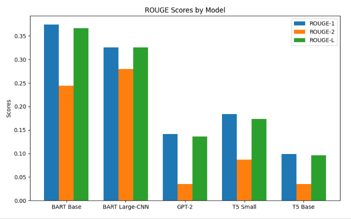
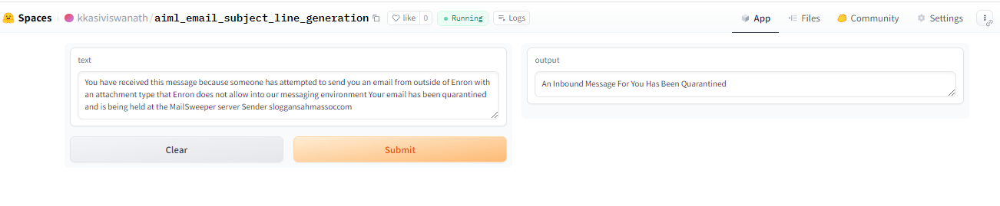
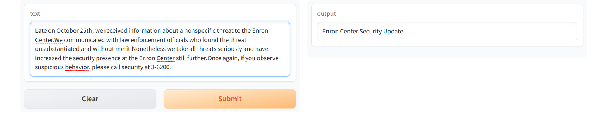
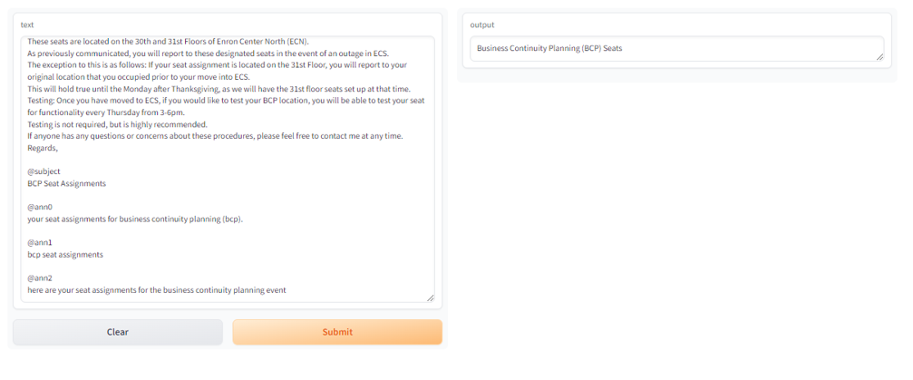
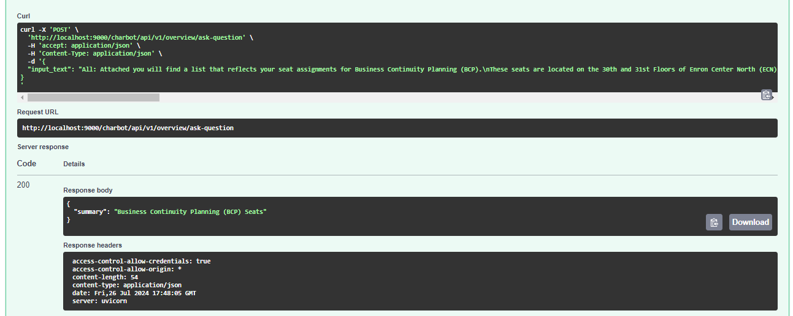

# AI-based Generative QA System

### Project Overview: Email Subject Line Generation

This project aims to generate email subject lines by leveraging generative models in NLP. Unlike tasks such as news summarization or headline generation, this task requires creating extremely short and concise summaries in the form of email subjects. Here are the key points:

1. **Unique Challenge**: The task involves identifying the most salient sentences from an email body and abstracting the message into a few words.
2. **Dataset**: Models are fine-tuned using the [Annotated Enron Subject Line Corpus](https://github.com/ryanzhumich/AESLC) dataset.

The Annotated Enron Subject Line Corpus (AESLC) is used, which consists of cleaned, filtered, and deduplicated emails from the Enron Email Corpus. The dataset includes multiple annotated subject lines for better evaluation.

3. **Splits and Statistics**:
   - Train / dev / test split sizes: 14,436 / 1,960 / 1,906
   - Average email length: 75 words
   - Average subject length: 4 words
4. **Generative Models**: The project explores the use of various GPT-2 variants and other models like BART and T5 for generating subject lines.
5. **Evaluation Metrics**: The effectiveness of the generated subject lines is evaluated using metrics such as ROUGE-1, ROUGE-2, and ROUGE-L.

### Model test with Zero Shot Inferencing

Zero-shot inferencing allows machine learning models to perform tasks without task-specific training, leveraging pre-trained knowledge to handle tasks like text classification, translation, and question answering. This approach saves time and resources, making it ideal for applications where labeled data is scarce or impractical to obtain.
   
   Several models were loaded directly from Hugging Face and random records were inferenced to see how the models were behaving.

   GPT-2, T5-small, T5-Base and Bart-Base and BART Large-CNN models were tried.

```python
pipe = pipeline("summarization", model="facebook/bart-large-cnn")

summarize_email(test_df, 0)
```

```plain
Email Body: You have received this message because someone has attempted to send you an email from outside of Enron with an attachment type that Enron does not allow into our messaging environment Your email has been quarantined and is being held at the MailSweeper server Sender sloggansahmassoccom


Subject Line: An Inbound Message For You Has Been Quarantined


Generated Summary: Your email has been quarantined and is being held at the MailSweeper server Sender sloggansahmassoccom.
```

## Model Fine-tune Training Details:

### Training Arguments Details

#### GPT-2 Training Arguments

```python

# Initialize tokenizer and model
tokenizer = GPT2Tokenizer.from_pretrained('gpt2')
tokenizer.pad_token = tokenizer.eos_token
model = GPT2LMHeadModel.from_pretrained('gpt2')

# Training arguments
training_args = TrainingArguments(
    output_dir='./results',
    overwrite_output_dir=True,
    num_train_epochs=3,
    per_device_train_batch_size=4,
    per_device_eval_batch_size=4,
    logging_dir='./logs',
    logging_steps=500,
    evaluation_strategy="epoch",
)

# Trainer
trainer = Trainer(
    model=model,
    args=training_args,
    train_dataset=train_dataset,
    eval_dataset=val_dataset,
    tokenizer=tokenizer,
)

# Fine-tuning the model
trainer.train()

```

| Epoch | Training Loss | Validation Loss |
|-------|---------------|-----------------|
| 1     | 0.094700      | 0.094323        |
| 2     | 0.087900      | 0.091184        |
| 3     | 0.078900      | 0.091783        |


#### BART Base Training Arguments

```python

# Initialize tokenizer and model
tokenizer = BartTokenizer.from_pretrained('facebook/bart-base')
model = BartForConditionalGeneration.from_pretrained('facebook/bart-base')

# Training arguments

training_args = TrainingArguments(
    output_dir='./results',
    overwrite_output_dir=True,
    num_train_epochs=3,
    per_device_train_batch_size=4,
    per_device_eval_batch_size=4,
    logging_dir='./logs',
    logging_steps=500,
    evaluation_strategy="epoch",
    report_to='none'
)

# Trainer
trainer = Trainer(
    model=model,
    args=training_args,
    train_dataset=train_dataset,
    eval_dataset=val_dataset,
    tokenizer=tokenizer,
)

# Fine-tuning the model
trainer.train()

```

| Epoch | Training Loss | Validation Loss |
|-------|---------------|-----------------|
| 1     | 0.092200      | 2.692427        |
| 2     | 0.064300      | 2.489501        |
| 3     | 0.043700      | 2.605197        |


#### BART Large-CNN Training Arguments

```python

# Initialize tokenizer and model
tokenizer = BartTokenizer.from_pretrained('facebook/bart-large-cnn')
model = BartForConditionalGeneration.from_pretrained('facebook/bart-large-cnn')

# Training arguments

training_args = TrainingArguments(
    output_dir = 'bart_summarizer',
    num_train_epochs = 5,
    per_device_train_batch_size = 4,
    per_device_eval_batch_size = 4,
    warmup_steps = 500,
    weight_decay = 0.01,
    logging_steps = 10,
    eval_strategy = 'steps',
    eval_steps = 500,
    save_steps = 5e5,
    report_to = 'none',
    learning_rate = 1e-5
)

# Trainer
trainer = Trainer(
    model=model,
    args=training_args,
    train_dataset=train_dataset,
    eval_dataset=val_dataset,
    tokenizer=tokenizer,
)

# Fine-tuning the model
trainer.train()

```
| Step | Training Loss | Validation Loss |
|------|---------------|-----------------|
| 500  | 2.860400      | 3.126819        |
| 1000 | 2.709500      | 2.954450        |
| 1500 | 2.825800      | 2.912150        |
| 2000 | 2.923600      | 2.880192        |
| 2500 | 2.933300      | 2.823426        |
| 3000 | 1.687400      | 2.824628        |
| 3500 | 2.112700      | 2.813528        |
| 4000 | 2.338800      | 2.791183        |


#### T5-Base Training Arguments

```python

# Initialize tokenizer and model
tokenizer = BartTokenizer.from_pretrained('t5-base')
model = BartForConditionalGeneration.from_pretrained('t5-base')

# Training arguments

training_args = TrainingArguments(
    output_dir='./results',
    overwrite_output_dir=True,
    num_train_epochs=3,
    per_device_train_batch_size=4,
    per_device_eval_batch_size=4,
    logging_dir='./logs',
    logging_steps=500,
    eval_strategy="epoch",
)

# Trainer
trainer = Trainer(
    model=model,
    args=training_args,
    train_dataset=train_dataset,
    eval_dataset=val_dataset,
    tokenizer=tokenizer,
)

# Fine-tuning the model
trainer.train()

```

| Epoch | Training Loss | Validation Loss |
|-------|---------------|-----------------|
| 1     | 0.022600      | 0.018911        |
| 2     | 0.018700      | 0.017477        |
| 3     | 0.016100      | 0.017105        |


#### T5-Small Training Arguments

```python

# Initialize tokenizer and model
tokenizer = BartTokenizer.from_pretrained('t5-small')
model = BartForConditionalGeneration.from_pretrained('t5-small')

# Training arguments

training_args = TrainingArguments(
    output_dir='./results',
    overwrite_output_dir=True,
    num_train_epochs=3,
    per_device_train_batch_size=4,
    per_device_eval_batch_size=4,
    logging_dir='./logs',
    logging_steps=500,
    evaluation_strategy="epoch",
)

# Trainer
trainer = Trainer(
    model=model,
    args=training_args,
    train_dataset=train_dataset,
    eval_dataset=val_dataset,
    tokenizer=tokenizer,
)

# Fine-tuning the model
trainer.train()

```

| Epoch | Training Loss | Validation Loss |
|-------|---------------|-----------------|
| 1     | 0.035700      | 0.029455        |
| 2     | 0.030300      | 0.027016        |
| 3     | 0.029400      | 0.026329        |

### Fine tuned model push to huggingface repo

```python
repo_name="bart_email_subject_text_summarizer"

model.push_to_hub(repo_name)
tokenizer.push_to_hub(repo_name)

```

**Reference**: [bart_email_subject_summarizer on Hugging Face](https://huggingface.co/spaces/kkasiviswanath/bart_email_subject_summarizer)

### Test with Fine tuned model

```python

model_name = "bart_email_subject_text_summarizer"
tokenizer = AutoTokenizer.from_pretrained(model_name)
model = AutoModelForSeq2SeqLM.from_pretrained(model_name)

pre_trained_model_pipe = pipeline("summarization", model="bart_email_subject_text_summarizer")

summarize_email(test_df, 1)

```

```
Email Body: Attached is a memo from Julia about a meeting going over some of the deals including power deals that were closed last year Background information on the deals could be helpful as several of these deals are likely to be administered by power trading Let LindaNoske know if you can make it lunch will be served


Subject Line: Finance meeting on structured deals


Generated Summary: Meeting to Discuss Power Trading Deals

```

### ROUGE Scores:

| Model            | ROUGE-1                | ROUGE-2                | ROUGE-L                |
|------------------|------------------------|------------------------|------------------------|
| GPT-2            | 0.1409                 | 0.0353                 | 0.1361                 |
| BART Base        | 0.3738                 | 0.2444                 | 0.3665                 |
| BART Large-CNN   | 0.3257                 | 0.2800                 | 0.3257                 |
| T5 Small         | 0.1835                 | 0.0866                 | 0.1732                 |
| T5 Base          | 0.0985                 | 0.0353                 | 0.0959                 |


| Model            | ROUGE-1 (Recall) | ROUGE-1 (Precision) | ROUGE-1 (F1) | ROUGE-2 (Recall) | ROUGE-2 (Precision) | ROUGE-2 (F1) | ROUGE-L (Recall) | ROUGE-L (Precision) | ROUGE-L (F1) |
|------------------|------------------|---------------------|--------------|------------------|---------------------|--------------|------------------|---------------------|--------------|
| GPT-2            | 0.2989           | 0.1570              | 0.1976       | 0.0819           | 0.0440              | 0.0546       | 0.2523           | 0.1311              | 0.1657       |
| BART Base        | 0.3738           | 0.2444              | 0.3665       | -                | -                   | -            | -                | -                   | -            |
| BART Large-CNN   | 0.3257           | 0.2800              | 0.3257       | -                | -                   | -            | -                | -                   | -            |
| T5 Small         | 0.1835           | 0.0866              | 0.1732       | -                | -                   | -            | -                | -                   | -            |
| T5 Base          | 0.0985           | 0.0353              | 0.0959       | -                | -                   | -            | -                | -                   | -            |





## Output for few Emails:

1. **Email** : The following reports have been waiting for your approval for more than 4 days.Please review.Owner: James W Reitmeyer Report Name: JReitmeyer 10/24/01 Days In Mgr.Queue: 5


   **Generated Subject**: Following report waiting approval
  
2. **Email** : All,  The below Analyst & Associate recruiting dates require ENA participation at Manager level at above.In order to resource each of your departments it is important to have ENA's involvement and participation in the interviews and debrief sessions on Fantastic Friday and Super Saturday events.These de-brief sessions will allow you the opportunity to select candidates you wish to join your groups.The target  is to assign potential candidates to business units and departments from the outset.As ENA has the highest percentage of A&A rotating in its business unit, the participation of ENA at interview should reflect this.Therefore, please encourage your direct reports and managers to participate in the below events in order to secure candidates for your business area.Associate Recruiting:		Saturday November 3						Total - 70 Candidates for Interview Analyst Recruiting:		Friday, November 16						Total - 70 Candidates for Interivew Associate Recruiting:		Saturday, December 1						Total - 70 Candidates for Interview  The above spreadsheet represents ENA's particpation today which I believe highlights the need for much additional support in these efforts.Please confirm by return participation of your respective groups.Regards,


   **Generated Subject**: Analyst associate recruiting date


3. **Email** : Late on October 25th, we received information about a nonspecific threat to the Enron Center.We communicated with law enforcement officials who found the threat unsubstantiated and without merit.Nonetheless we take all threats seriously and have increased the security presence at the Enron Center still further.Once again, if you observe suspicious behavior, please call security at 3-6200.


   **Generated Subject**: Late october 25th received


**Huggingface Spaces**:

[HuggingFace Spaces Gradio app](https://huggingface.co/spaces/kkasiviswanath/aiml_email_subject_line_generation)






**Fastapi Output**:

**Request**:


**Response**:



#### ROUGE Scores Explanation:

- **ROUGE-1** measures the overlap of unigrams (single words) between the generated and reference summaries. Higher scores indicate better performance in capturing essential words.

- **ROUGE-2** evaluates the overlap of bigrams (two consecutive words). It provides insight into how well the model captures pairs of words.

- **ROUGE-L** assesses the longest common subsequence between the generated and reference summaries. It reflects the fluency and coherence of the generated text.

## Evaluation Metrics

Each of these metrics can be evaluated in terms of:

- **Precision**: The fraction of n-grams in the generated summary that are also in the reference summary.

- **Recall**: The fraction of n-grams in the reference summary that are also in the generated summary.

- **F1 Score**: The harmonic mean of precision and recall, providing a balanced measure.


### Model Information:

#### GPT-2:
1. **Architecture**: Generative Pre-trained Transformer 2.
2. **Training**: Trained on a diverse dataset for generating text.
3. **Strengths**: Good for creative and diverse text generation.
4. **Evaluation**: Lower ROUGE scores compared to BART models, but useful for generating varied outputs.
5. **Reference**: [GPT-2 on Hugging Face](https://huggingface.co/openai-community/gpt2)

#### BART Base:
1. **Architecture**: Bidirectional and Auto-Regressive Transformers.
2. **Training**: Pretrained on a large corpus of text and fine-tuned for summarization tasks.
3. **Usage**: Effective for generating coherent and fluent summaries.
4. **Evaluation**: High ROUGE scores, indicating good performance in generating relevant subject lines.
5. **Reference**: [BART Base on Hugging Face](https://huggingface.co/facebook/bart-base)

#### BART Large-CNN:
1. **Architecture**: Larger variant of BART with more parameters.
2. **Training**: Pretrained and fine-tuned for text summarization.
3. **Performance**: Balances recall and precision well, with high ROUGE scores.
4. **Usage**: Suitable for generating detailed and accurate summaries.
5. **Reference**: [BART Large-CNN on Hugging Face](https://huggingface.co/facebook/bart-large-cnn)

#### T5 Small:
1. **Architecture**: Text-To-Text Transfer Transformer.
2. **Training**: Converts all tasks to a text-to-text format.
3. **Efficiency**: Smaller model, faster inference.
4. **Performance**: Moderate ROUGE scores, balancing speed and accuracy.
5. **Reference**: [T5 Small on Hugging Face](https://huggingface.co/google-t5/t5-small)

#### T5 Base:
1. **Architecture**: Larger than T5 Small, with more parameters.
2. **Training**: Pretrained on a vast corpus and fine-tuned for specific tasks.
3. **Performance**: Provides a good balance of speed and accuracy.
4. **Usage**: Suitable for various text generation tasks with reasonable efficiency.
5. **Reference**: [T5 Base on Hugging Face](https://huggingface.co/google-t5/t5-base)


### Detailed Analysis of ROUGE Scores

1. **Model Architecture**:
    - **BART Base and BART Large-CNN**: These models are based on the BART architecture, which combines bidirectional and autoregressive transformers. This allows BART to capture both the context of words and generate coherent text sequences. The architecture is specifically designed for text generation tasks, making it highly effective for summarization.

    - **GPT-2**: While GPT-2 is a powerful language model, it is primarily autoregressive, meaning it predicts the next word in a sequence based on previous words. This can limit its ability to capture the full context compared to models like BART, which use bidirectional transformers during the encoding phase.

    - **T5 Small and T5 Base**: T5 (Text-To-Text Transfer Transformer) models convert all NLP tasks into a text-to-text format, which is a versatile approach. However, the smaller versions of T5 might lack the capacity to capture complex dependencies and nuances as effectively as larger models.

2. **Training Data and Objectives**:
    - **BART**: Pre-trained on large corpora with a denoising autoencoder objective, which involves corrupting text and training the model to reconstruct it. This helps BART learn robust representations and improve its ability to generate coherent and contextually appropriate summaries.

    - **GPT-2**: Trained to predict the next token in a sequence, which is excellent for generating text but may not be as effective for tasks requiring understanding and condensing information, like summarization.

    - **T5**: Trained on a variety of text-to-text tasks, including summarization. However, the smaller versions may not perform as well due to limited capacity and fewer parameters compared to larger models like BART.

3. **Model Size and Capacity**:
    - **BART Large-CNN**: Larger models with more parameters can capture more complex patterns in data and generate more accurate summaries, leading to higher ROUGE scores. The larger variant of BART has more capacity to understand and generate detailed summaries.

    - **T5 Small vs. T5 Base**: The smaller T5 models have fewer parameters and, consequently, less capacity to capture detailed information, leading to lower ROUGE scores compared to larger models.

4. **Pre-training Tasks and Fine-Tuning**:
    - **BART**: Specifically fine-tuned on summarization datasets, making it highly effective for the task. The fine-tuning process helps the model adapt to the nuances of summarization, leading to better performance and higher ROUGE scores.

    - **GPT-2**: While it can be fine-tuned for summarization, its pre-training objective is not specifically tailored for this task, which can result in lower ROUGE scores compared to models pre-trained with summarization in mind.

    - **T5**: The flexibility of T5's text-to-text framework allows for effective fine-tuning, but smaller models may still struggle with capturing detailed information compared to larger models.

### Specific Reasons for Score Differences

1. **BART Base vs. GPT-2**:
    - BART Base's bidirectional encoder captures context better, leading to higher ROUGE scores.
    - GPT-2's autoregressive nature limits its ability to summarize effectively, resulting in lower scores.

2. **BART Large-CNN vs. T5 Small**:
    - BART Large-CNN's larger model size and capacity enable it to capture more details, producing higher ROUGE scores.
    - T5 Small, with fewer parameters, struggles to match the performance of larger models like BART Large-CNN.

3. **T5 Base vs. T5 Small**:
    - T5 Base has more parameters than T5 Small, allowing it to perform better on summarization tasks, but still falls short compared to models like BART due to capacity limitations.


## Group Details

**Group No:** 17

### Team Members
- Archit Garg
- Dinesh
- Chandrasekhar B
- K Kasi Viswanath


