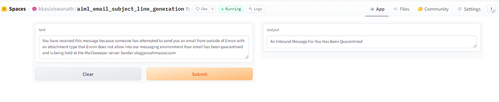
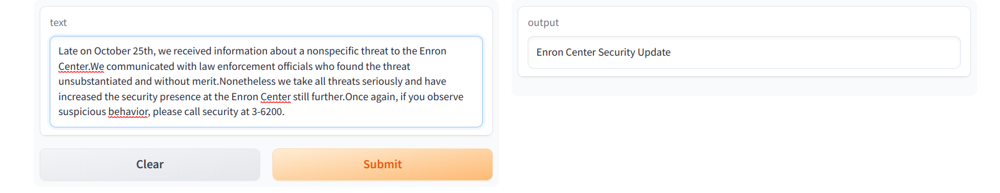
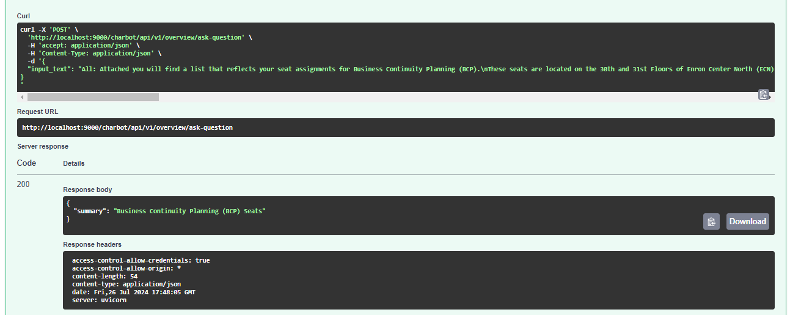

# AI-based Generative QA System

## Email Subject Line Generation

### Project Overview: 

This project aims to generate email subject lines by leveraging generative models in NLP. Unlike tasks such as news summarization or headline generation, this task requires creating extremely short and concise summaries in the form of email subjects. Here are the key points:

1. **Unique Challenge**: The task involves identifying the most salient sentences from an email body and abstracting the message into a few words.
2. **Dataset**: Models are fine-tuned using the [Annotated Enron Subject Line Corpus](https://github.com/ryanzhumich/AESLC) dataset.

The Annotated Enron Subject Line Corpus (AESLC) is used, which consists of cleaned, filtered, and deduplicated emails from the Enron Email Corpus. The dataset includes multiple annotated subject lines for better evaluation.

3. **Splits and Statistics**:
   - Train / dev / test split sizes: 14,436 / 1,960 / 1,906
   - Average email length: 75 words
   - Average subject length: 4 words
4. **Generative Models**: The project explores the use of various GPT-2 variants and other models like BART and T5 for generating subject lines.
5. **Evaluation Metrics**: The effectiveness of the generated subject lines is evaluated using metrics such as ROUGE-1, ROUGE-2, and ROUGE-L.

## Email Subject Line Generation project Presentation

The presentation for this project is available at the following link:

[Project Presentation](https://docs.google.com/presentation/d/1iCa1x0giIs08pxeTkgjQnlOkj8MNJTVQ/edit?usp=sharing&ouid=113459448125305271774&rtpof=true&sd=true)


## AESLC data Preprocessing

The preprocessing for the emails subjects is done in a Jupyter Notebook. You can find the detailed preprocessing steps in the following notebook:

[Preprocessing Notebook](https://github.com/viswa3024/aiml-capstone-project-email/blob/main/email-subject/pre-process/email_subject_pre_process_v1.ipynb)

### Model test with Zero Shot Inferencing

Zero-shot inferencing allows machine learning models to perform tasks without task-specific training, leveraging pre-trained knowledge to handle tasks like text classification, translation, and question answering. This approach saves time and resources, making it ideal for applications where labeled data is scarce or impractical to obtain.
   
   Several models were loaded directly from Hugging Face and random records were inferenced to see how the models were behaving.

   GPT-2, T5-small, T5-Base and Bart-Base and BART Large-CNN models were tried.

```python
pipe = pipeline("summarization", model="facebook/bart-large-cnn")

summarize_email(test_df, 0)
```

```
Email Body: You have received this message because someone has attempted to send you an email from outside of Enron with an attachment type that Enron does not allow into our messaging environment Your email has been quarantined and is being held at the MailSweeper server Sender sloggansahmassoccom


Subject Line: An Inbound Message For You Has Been Quarantined


Generated Summary: Your email has been quarantined and is being held at the MailSweeper server Sender sloggansahmassoccom.
```

## Model Fine-tune Training Details:

### Training Arguments Details

#### GPT-2 Training Arguments

```python

# Initialize tokenizer and model
tokenizer = GPT2Tokenizer.from_pretrained('gpt2')
tokenizer.pad_token = tokenizer.eos_token
model = GPT2LMHeadModel.from_pretrained('gpt2')

# Training arguments
training_args = TrainingArguments(
    output_dir='./results',
    overwrite_output_dir=True,
    num_train_epochs=3,
    per_device_train_batch_size=4,
    per_device_eval_batch_size=4,
    logging_dir='./logs',
    logging_steps=500,
    evaluation_strategy="epoch",
)

# Trainer
trainer = Trainer(
    model=model,
    args=training_args,
    train_dataset=train_dataset,
    eval_dataset=val_dataset,
    tokenizer=tokenizer,
)

# Fine-tuning the model
trainer.train()

```

| Epoch | Training Loss | Validation Loss |
|-------|---------------|-----------------|
| 1     | 0.094700      | 0.094323        |
| 2     | 0.087900      | 0.091184        |
| 3     | 0.078900      | 0.091783        |

#### distilgpt2 Training Arguments

```python

# Initialize tokenizer and model
tokenizer = GPT2Tokenizer.from_pretrained('distilgpt2', bos_token='<|startoftext|>',
                                          eos_token='<|endoftext|>', pad_token='<|pad|>', sep_token='<|sep|>')
model = GPT2LMHeadModel.from_pretrained('distilgpt2').cuda()
model.resize_token_embeddings(len(tokenizer))

datacollator = DataCollatorForLanguageModeling(tokenizer = tokenizer, mlm=False)

# Training arguments
training_args = TrainingArguments(
    output_dir='./results',
    overwrite_output_dir=True,
    num_train_epochs=15,
    per_device_train_batch_size=8,
    per_device_eval_batch_size=16,
    #eval_steps = 2,
    eval_steps = 400,
    save_steps=800,
    warmup_steps=500,
    load_best_model_at_end=True,
    #evaluation_strategy="steps",
    #save_strategy = "steps",
    eval_strategy="epoch",
    save_strategy = "epoch",
    weight_decay=0.01,
    metric_for_best_model = "rougeL",
    gradient_accumulation_steps=4,
    gradient_checkpointing=True,
    fp16=True,
    logging_dir='./logs',
    logging_steps=500,
    report_to = 'none'
    )

def compute_metrics(eval_pred, eval_dataset, df):
    decoded_preds = []
    references = [df['Subject'], df['Ann0'], df['Ann1'], df['Ann2']]
    refs = []

    for i, sample_input in enumerate(eval_dataset):
        temp_input = sample_input[0][sample_input[0] !=torch.Tensor(np.array([50259]))]
        temp_input = temp_input[None, :]
        metric_outputs = model.generate(temp_input.cuda(), min_new_tokens = 4, max_new_tokens = 12, num_beams=5, early_stopping=True, num_return_sequences=1, pad_token_id=tokenizer.eos_token_id)
        decoded_preds.append(tokenizer.decode(metric_outputs[0]))

    final_preds =[]
    for j in range(len(decoded_preds)):
        lst = decoded_preds[j].split('<|sep|>')
        if (len(lst) >= 2):
            final_preds.append(lst[1].replace("<|endoftext|>",""))
        temp_refs = []
        for k in range(len(references)):
            temp_refs.append(references[k][j])
        refs.append(temp_refs)

    results_sacrebleu = sacrebleu.compute(predictions=final_preds, references=refs, lowercase = True)

    results_rouge = rouge.compute(predictions=final_preds, references=refs)

    results_meteor = meteor.compute(predictions=final_preds, references=refs)

    return {'bleu': results_sacrebleu['score'], 'rouge1' : results_rouge['rouge1'], 'rouge2' : results_rouge['rouge2'], 'rougeL' : results_rouge['rougeL'], 'meteor' : results_meteor['meteor']}

def preprocess_logits_for_metrics(logits, labels):
    """
    Original Trainer may have a memory leak.
    This is a workaround to avoid storing too many tensors that are not needed.
    """
    pred_ids = torch.argmax(logits, dim=-1)
    return pred_ids, labels

# Trainer
trainer = Trainer(model=model, args=training_args, train_dataset=train_dataset, eval_dataset=val_dataset, data_collator=datacollator, compute_metrics = lambda pred: compute_metrics(pred, val_dataset, df_val), preprocess_logits_for_metrics = preprocess_logits_for_metrics)

# Fine-tuning the model
trainer.train()

```

| Epoch | Training Loss | Validation Loss | Bleu     | Rouge1   | Rouge2   | Rougel   | Meteor   |
|-------|---------------|-----------------|----------|----------|----------|----------|----------|
| 0     | No log        | 3.635086        | 22.275357| 0.396282 | 0.257464 | 0.387752 | 0.349411 |
| 1     | 9.029100      | 3.502780        | 25.557314| 0.450736 | 0.291413 | 0.440516 | 0.391040 |
| 2     | 3.497900      | 3.452860        | 26.260277| 0.453120 | 0.290963 | 0.443728 | 0.390699 |
| 4     | 3.229800      | 3.391281        | 25.545666| 0.458376 | 0.291450 | 0.447598 | 0.397724 |
| 5     | 3.150500      | 3.382005        | 25.043569| 0.445259 | 0.278428 | 0.435483 | 0.382040 |
| 6     | 3.072000      | 3.370845        | 24.800867| 0.446951 | 0.282857 | 0.437950 | 0.388445 |
| 8     | 2.981300      | 3.362299        | 25.697474| 0.449789 | 0.284316 | 0.441184 | 0.388667 |
| 9     | 2.934100      | 3.364068        | 25.153556| 0.453883 | 0.286736 | 0.444161 | 0.392419 |
| 10    | 2.934100      | 3.367672        | 24.701893| 0.448453 | 0.282733 | 0.438903 | 0.388467 |
| 12    | 2.880000      | 3.372470        | 24.452949| 0.442268 | 0.276134 | 0.432714 | 0.380930 |
| 13    | 2.852600      | 3.364959        | 24.576658| 0.445328 | 0.277127 | 0.435705 | 0.384882 |
| 14    | 2.846500      | 3.371709        | 24.588771| 0.444948 | 0.277517 | 0.435337 | 0.384406 |

#### GPT-2-Medium Training Arguments

```python

# Initialize tokenizer and model
tokenizer = GPT2Tokenizer.from_pretrained('gpt2-medium', bos_token='<|startoftext|>',
                                          eos_token='<|endoftext|>', pad_token='<|pad|>', sep_token='<|sep|>')
model = GPT2LMHeadModel.from_pretrained('gpt2-medium').cuda()
model.resize_token_embeddings(len(tokenizer))

datacollator = DataCollatorForLanguageModeling(tokenizer = tokenizer, mlm=False)

# Training arguments
training_args = TrainingArguments(
    output_dir='./results',
    overwrite_output_dir=True,
    num_train_epochs=15,
    per_device_train_batch_size=8,
    per_device_eval_batch_size=16,
    #eval_steps = 2,
    eval_steps = 400,
    save_steps=800,
    warmup_steps=500,
    load_best_model_at_end=True,
    #evaluation_strategy="steps",
    #save_strategy = "steps",
    eval_strategy="epoch",
    save_strategy = "epoch",
    weight_decay=0.01,
    metric_for_best_model = "rougeL",
    gradient_accumulation_steps=4,
    gradient_checkpointing=True,
    fp16=True,
    logging_dir='./logs',
    logging_steps=500,
    report_to = 'none',
    save_total_limit = 1
    )

def compute_metrics(eval_pred, eval_dataset, df):
    decoded_preds = []
    references = [df['Subject'], df['Ann0'], df['Ann1'], df['Ann2']]
    refs = []

    for i, sample_input in enumerate(eval_dataset):
        temp_input = sample_input[0][sample_input[0] !=torch.Tensor(np.array([50259]))]
        temp_input = temp_input[None, :]
        metric_outputs = model.generate(temp_input.cuda(), min_new_tokens = 4, max_new_tokens = 12, num_beams=5, early_stopping=True, num_return_sequences=1, pad_token_id=tokenizer.eos_token_id)
        decoded_preds.append(tokenizer.decode(metric_outputs[0]))

    final_preds =[]
    for j in range(len(decoded_preds)):
        lst = decoded_preds[j].split('<|sep|>')
        if (len(lst) >= 2):
            final_preds.append(lst[1].replace("<|endoftext|>",""))
        temp_refs = []
        for k in range(len(references)):
            temp_refs.append(references[k][j])
        refs.append(temp_refs)

    results_sacrebleu = sacrebleu.compute(predictions=final_preds, references=refs, lowercase = True)

    results_rouge = rouge.compute(predictions=final_preds, references=refs)

    results_meteor = meteor.compute(predictions=final_preds, references=refs)

    return {'bleu': results_sacrebleu['score'], 'rouge1' : results_rouge['rouge1'], 'rouge2' : results_rouge['rouge2'], 'rougeL' : results_rouge['rougeL'], 'meteor' : results_meteor['meteor']}

def preprocess_logits_for_metrics(logits, labels):
    """
    Original Trainer may have a memory leak.
    This is a workaround to avoid storing too many tensors that are not needed.
    """
    pred_ids = torch.argmax(logits, dim=-1)
    return pred_ids, labels

# Trainer
trainer = Trainer(model=model, args=training_args, train_dataset=train_dataset, eval_dataset=val_dataset, data_collator=datacollator, compute_metrics = lambda pred: compute_metrics(pred, val_dataset, df_val), preprocess_logits_for_metrics = preprocess_logits_for_metrics)

# Fine-tuning the model
trainer.train()

```

| Epoch | Training Loss | Validation Loss | Bleu     | Rouge1   | Rouge2   | Rougel   | Meteor   |
|-------|---------------|-----------------|----------|----------|----------|----------|----------|
| 0     | No log        | 3.240009        | 23.335480| 0.438956 | 0.280590 | 0.427356 | 0.376896 |
| 1     | 9.291000      | 3.115303        | 24.349057| 0.452958 | 0.291251 | 0.439128 | 0.392938 |
| 2     | 2.974400      | 3.067280        | 26.348562| 0.464540 | 0.301626 | 0.450059 | 0.407104 |
| 4     | 2.590900      | 3.037925        | 26.490910| 0.460947 | 0.294609 | 0.446197 | 0.402065 |
| 5     | 2.442400      | 3.039589        | 26.183558| 0.464822 | 0.291021 | 0.449664 | 0.401436 |
| 6     | 2.320800      | 3.065905        | 25.271196| 0.463833 | 0.291412 | 0.448254 | 0.403242 |
| 8     | 2.110700      | 3.123140        | 24.627987| 0.444409 | 0.272727 | 0.432048 | 0.383493 |
| 9     | 2.029000      | 3.100409        | 24.813734| 0.453561 | 0.283925 | 0.439301 | 0.394933 |
| 10    | 2.029000      | 3.160328        | 24.009993| 0.444062 | 0.268069 | 0.429838 | 0.378144 |
| 12    | 1.907900      | 3.193829        | 23.761859| 0.438667 | 0.267829 | 0.425131 | 0.377799 |
| 13    | 1.859100      | 3.211579        | 24.451897| 0.435391 | 0.265776 | 0.421576 | 0.371685 |
| 14    | 1.838900      | 3.220527        | 23.986481| 0.434484 | 0.264097 | 0.420290 | 0.372747 |


#### BART Base Training Arguments

```python

# Initialize tokenizer and model
tokenizer = BartTokenizer.from_pretrained('facebook/bart-base')
model = BartForConditionalGeneration.from_pretrained('facebook/bart-base')

# Training arguments

training_args = TrainingArguments(
    output_dir='./results',
    overwrite_output_dir=True,
    num_train_epochs=3,
    per_device_train_batch_size=4,
    per_device_eval_batch_size=4,
    logging_dir='./logs',
    logging_steps=500,
    evaluation_strategy="epoch",
    report_to='none'
)

# Trainer
trainer = Trainer(
    model=model,
    args=training_args,
    train_dataset=train_dataset,
    eval_dataset=val_dataset,
    tokenizer=tokenizer,
)

# Fine-tuning the model
trainer.train()

```

| Epoch | Training Loss | Validation Loss |
|-------|---------------|-----------------|
| 1     | 0.092200      | 2.692427        |
| 2     | 0.064300      | 2.489501        |
| 3     | 0.043700      | 2.605197        |


#### BART Large-CNN Training Arguments

```python

# Initialize tokenizer and model
tokenizer = BartTokenizer.from_pretrained('facebook/bart-large-cnn')
model = BartForConditionalGeneration.from_pretrained('facebook/bart-large-cnn')

# Training arguments

training_args = TrainingArguments(
    output_dir = 'bart_summarizer',
    num_train_epochs = 5,
    per_device_train_batch_size = 4,
    per_device_eval_batch_size = 4,
    warmup_steps = 500,
    weight_decay = 0.01,
    logging_steps = 10,
    eval_strategy = 'steps',
    eval_steps = 500,
    save_steps = 5e5,
    report_to = 'none',
    learning_rate = 1e-5
)

# Trainer
trainer = Trainer(
    model=model,
    args=training_args,
    train_dataset=train_dataset,
    eval_dataset=val_dataset,
    tokenizer=tokenizer,
)

# Fine-tuning the model
trainer.train()

```
| Step | Training Loss | Validation Loss |
|------|---------------|-----------------|
| 500  | 2.860400      | 3.126819        |
| 1000 | 2.709500      | 2.954450        |
| 1500 | 2.825800      | 2.912150        |
| 2000 | 2.923600      | 2.880192        |
| 2500 | 2.933300      | 2.823426        |
| 3000 | 1.687400      | 2.824628        |
| 3500 | 2.112700      | 2.813528        |
| 4000 | 2.338800      | 2.791183        |


#### T5-Base Training Arguments

```python

# Initialize tokenizer and model
tokenizer = BartTokenizer.from_pretrained('t5-base')
model = BartForConditionalGeneration.from_pretrained('t5-base')

# Training arguments

training_args = TrainingArguments(
    output_dir='./results',
    overwrite_output_dir=True,
    num_train_epochs=3,
    per_device_train_batch_size=4,
    per_device_eval_batch_size=4,
    logging_dir='./logs',
    logging_steps=500,
    eval_strategy="epoch",
)

# Trainer
trainer = Trainer(
    model=model,
    args=training_args,
    train_dataset=train_dataset,
    eval_dataset=val_dataset,
    tokenizer=tokenizer,
)

# Fine-tuning the model
trainer.train()

```

| Epoch | Training Loss | Validation Loss |
|-------|---------------|-----------------|
| 1     | 0.022600      | 0.018911        |
| 2     | 0.018700      | 0.017477        |
| 3     | 0.016100      | 0.017105        |


#### T5-Small Training Arguments

```python

# Initialize tokenizer and model
tokenizer = BartTokenizer.from_pretrained('t5-small')
model = BartForConditionalGeneration.from_pretrained('t5-small')

# Training arguments

training_args = TrainingArguments(
    output_dir='./results',
    overwrite_output_dir=True,
    num_train_epochs=3,
    per_device_train_batch_size=4,
    per_device_eval_batch_size=4,
    logging_dir='./logs',
    logging_steps=500,
    evaluation_strategy="epoch",
)

# Trainer
trainer = Trainer(
    model=model,
    args=training_args,
    train_dataset=train_dataset,
    eval_dataset=val_dataset,
    tokenizer=tokenizer,
)

# Fine-tuning the model
trainer.train()

```

| Epoch | Training Loss | Validation Loss |
|-------|---------------|-----------------|
| 1     | 0.035700      | 0.029455        |
| 2     | 0.030300      | 0.027016        |
| 3     | 0.029400      | 0.026329        |

### Fine tuned model push to huggingface repo

```python
repo_name="bart_email_subject_text_summarizer"

model.push_to_hub(repo_name)
tokenizer.push_to_hub(repo_name)

```

**Reference**: [bart_email_subject_summarizer on Hugging Face](https://huggingface.co/kkasiviswanath/bart_summarizer_deploy_v1)

### Test with Fine tuned model

```python

model_name = "bart_email_subject_text_summarizer"
tokenizer = AutoTokenizer.from_pretrained(model_name)
model = AutoModelForSeq2SeqLM.from_pretrained(model_name)

pre_trained_model_pipe = pipeline("summarization", model="bart_email_subject_text_summarizer")

summarize_email(test_df, 1)

```

```
Email Body: Attached is a memo from Julia about a meeting going over some of the deals including power deals that were closed last year Background information on the deals could be helpful as several of these deals are likely to be administered by power trading Let LindaNoske know if you can make it lunch will be served


Subject Line: Finance meeting on structured deals


Generated Summary: Meeting to Discuss Power Trading Deals

```

### ROUGE Scores:

| Model            | ROUGE-1                | ROUGE-2                | ROUGE-L                |
|------------------|------------------------|------------------------|------------------------|
| GPT-2            | 0.1409                 | 0.0353                 | 0.1361                 |
| distilgpt2       | 0.4598                 | 0.2991                 | 0.4485                 |
| GPT2-Medium      | 0.4799                 | 0.3165                 | 0.4652                 |
| BART Base        | 0.3738                 | 0.2444                 | 0.3665                 |
| BART Large-CNN   | 0.3257                 | 0.2800                 | 0.3257                 |
| T5 Small         | 0.1835                 | 0.0866                 | 0.1732                 |
| T5 Base          | 0.0985                 | 0.0353                 | 0.0959                 |


| Model            | ROUGE-1 (Recall) | ROUGE-1 (Precision) | ROUGE-1 (F1) | ROUGE-2 (Recall) | ROUGE-2 (Precision) | ROUGE-2 (F1) | ROUGE-L (Recall) | ROUGE-L (Precision) | ROUGE-L (F1) |
|------------------|------------------|---------------------|--------------|------------------|---------------------|--------------|------------------|---------------------|--------------|
| GPT-2            | 0.2989           | 0.1570              | 0.1976       | 0.0819           | 0.0440              | 0.0546       | 0.2523           | 0.1311              | 0.1657       |


## Output for few Emails:

1. **Email** : The following reports have been waiting for your approval for more than 4 days.Please review.Owner: James W Reitmeyer Report Name: JReitmeyer 10/24/01 Days In Mgr.Queue: 5


   **Generated Subject**: Following report waiting approval
  
2. **Email** : All,  The below Analyst & Associate recruiting dates require ENA participation at Manager level at above.In order to resource each of your departments it is important to have ENA's involvement and participation in the interviews and debrief sessions on Fantastic Friday and Super Saturday events.These de-brief sessions will allow you the opportunity to select candidates you wish to join your groups.The target  is to assign potential candidates to business units and departments from the outset.As ENA has the highest percentage of A&A rotating in its business unit, the participation of ENA at interview should reflect this.Therefore, please encourage your direct reports and managers to participate in the below events in order to secure candidates for your business area.Associate Recruiting:		Saturday November 3						Total - 70 Candidates for Interview Analyst Recruiting:		Friday, November 16						Total - 70 Candidates for Interivew Associate Recruiting:		Saturday, December 1						Total - 70 Candidates for Interview  The above spreadsheet represents ENA's particpation today which I believe highlights the need for much additional support in these efforts.Please confirm by return participation of your respective groups.Regards,


   **Generated Subject**: Analyst associate recruiting date


3. **Email** : Late on October 25th, we received information about a nonspecific threat to the Enron Center.We communicated with law enforcement officials who found the threat unsubstantiated and without merit.Nonetheless we take all threats seriously and have increased the security presence at the Enron Center still further.Once again, if you observe suspicious behavior, please call security at 3-6200.


   **Generated Subject**: Late october 25th received


**Huggingface Spaces**:

[HuggingFace Spaces Gradio app](https://huggingface.co/spaces/kkasiviswanath/aiml_email_subject_line_generation)





**Fastapi Output**:

**Request**:


**Response**:


**Sample GUI**


### Deployment links

The deployment of the email subject line generation model using Hugging Face and Gradio can be found in the following directory:

[Hugging Face Gradio Deployment](./email-subject/deployment/huggingface-gradio/aiml_email_subject_line_generation)

### FastAPI

The FastAPI implementation for the project is available at:

[FastAPI Repository](https://github.com/viswa3024/chat-bot-api)

### GUI

The graphical user interface (GUI) for interacting with the model is hosted here:

[Chat Bot UI](https://github.com/viswa3024/chat-bot-ui)


## Group Details

**Group No:** 17

### Team Members
- Chandrasekhar B
- K Kasi Viswanath


