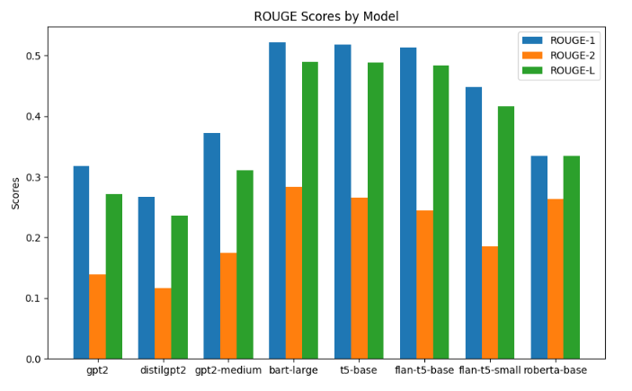

# AI-based Generative QA System

## Question Answering on AIML Queries

### Project Overview:

To fine-tune a GPT-variant model (such as GPT-2) on a curated, domain-specific dataset that will improve its capability to answer questions specific to the AIML course. While general-purpose pretrained models can generate reasonable responses to open-domain queries, they often struggle with domain-specific knowledge. The fine-tuning process addresses this limitation by training the model on a relevant dataset.

## Dataset Overview

The dataset for this project is being developed collaboratively by all participating teams in the AIML course, with contributions following a consistent format.

### Source: 

Each team will be provided with 250 questions extracted from AIML course material covered in lectures.
### Structure: 

Teams are required to provide short answers (1-2 lines) for each question and store them in a CSV file.

### Format:

 Once the dataset is ready, a common train, dev, and test split will be distributed for further modeling tasks.

 ## Datasets

 [datasets](./question-answering/datasets): Contains all datasets  used for fine-tuning the models.


## Generative Models: 
The project explores the use of various GPT-2 variants and other models like BART and T5 for generating answers.

## Evaluation Metrics: 
The effectiveness of the generated answers is evaluated using metrics such as ROUGE-1, ROUGE-2, and ROUGE-L.


## Datasets data Preprocessing

The preprocessing for the question and answers is done in a Jupyter Notebook. You can find the detailed preprocessing steps in the following notebook:

[Preprocessing Notebooks](./question-answering/pre-process)

### Model test with Zero Shot Inferencing

Zero-shot inferencing allows machine learning models to perform tasks without task-specific training, leveraging pre-trained knowledge to handle tasks like text classification, translation, and question answering. This approach saves time and resources, making it ideal for applications where labeled data is scarce or impractical to obtain.
   
   Several models were loaded directly from Hugging Face and random records were inferenced to see how the models were behaving.

   GPT-2, T5-small, T5-Base and Bart-Base and BART Large-CNN models were tried.

```python
from transformers import pipeline

gpt2_medium_qa_pipeline = pipeline('text-generation', model='gpt2-medium')

def clean_generated_answer(answer):
    text = answer[0]['generated_text'].strip()
    cleaned_text = text.replace('\n\n', ' ').replace('\n', ' ')
    return cleaned_text

# Example usage
question = "Can we utilize an autoencoder to perform dimensionality reduction on numerical datasets?"
answer = generate_answer_with_pipeline(question, gpt2_medium_qa_pipeline)
print("Generated Answer:", answer)
```

```
Question: Can we utilize an autoencoder to perform dimensionality reduction on numerical datasets?


Answer1: Yes, autoencoders can be applied to numerical datasets for dimensionality reduction by learning a compressed input data representation. They can effectively capture nonlinear relationships and efficiently reduce the dimensionality.

Answer2: Yes, autoencoders can be used for dimensionality reduction. By training the autoencoder, it learns a compressed representation of the input data, allowing for a lower-dimensional representation that retains important features.


Generated Answer: Concatenation: A concatenation is a sequence of two tensor values. For example, the following concatenates two tensor values: a and b are two tensors and are two tensors c, d and e are two tensors, and are two tensors, a and b are two tensors, and are two tensors, c, d and e are two tensors, and are two tensors, c, d and e are two tensors, and are two tensors, b, c and e are two tensors, and are two tensors, a, c and d are two tensors, and are two tensors, a, c and d are two tensors, and are two tensors, b, c, and e are two tensors, and are two tensors, a, c and d are two tens
```

## Model Fine-tune Training Details:

### Training Arguments Details

#### GPT-2 Training Arguments

```python

# Initialize tokenizer and model
tokenizer = GPT2Tokenizer.from_pretrained('gpt2', bos_token='<|startoftext|>',
                                          eos_token='<|endoftext|>', pad_token='<|pad|>', sep_token='<|sep|>')
model = GPT2LMHeadModel.from_pretrained('gpt2').cuda()
model.resize_token_embeddings(len(tokenizer))

datacollator = DataCollatorForLanguageModeling(tokenizer = tokenizer, mlm=False)

# Training arguments
training_args = TrainingArguments(
    output_dir="./output",
    overwrite_output_dir=True,
    num_train_epochs=20,
    per_device_train_batch_size=8,
    per_device_eval_batch_size=16,
    eval_steps=400,
    save_steps=800,
    warmup_steps=500,
    load_best_model_at_end=True,
    eval_strategy="epoch",
    save_strategy="epoch",
    weight_decay=0.01,
    logging_dir='./logs',
    logging_steps=10,
    metric_for_best_model="rougeL",  # Change this to "rougeL"
    gradient_accumulation_steps=4,
    gradient_checkpointing=True,
    fp16=True,
    report_to='none',
    save_total_limit=1
)

# Define compute_metrics function
def compute_metrics(eval_pred, eval_dataset, df):
    decoded_preds = []
    references = [df['answer1'], df['answer2']]
    refs = []

    # Generate predictions for the validation dataset
    for i, sample_input in enumerate(eval_dataset):
        temp_input = sample_input[0][sample_input[0] != torch.Tensor(np.array([50259]))]
        temp_input = temp_input[None, :]
        metric_outputs = model.generate(temp_input.cuda(), min_new_tokens=60, max_new_tokens=200, penalty_alpha=0.6, top_k=4, num_return_sequences=1, pad_token_id=tokenizer.eos_token_id)
        decoded_preds.append(tokenizer.decode(metric_outputs[0]))

    final_preds = []
    for j in range(len(decoded_preds)):
        lst = decoded_preds[j].split('<|sep|>')
        if len(lst) >= 2:
            temp_decoded = lst[1].replace("<|endoftext|>", "")
            final_preds.append(temp_decoded.split('___')[0])
        else:
            print(f'{j}: {lst[0]}')

        temp_refs = []
        for k in range(len(references)):
            temp_refs.append(references[k][j])
        refs.append(temp_refs)

    # Compute BLEU, ROUGE, and METEOR metrics
    results_bleu = bleu.compute(predictions=final_preds, references=refs)
    results_rouge = rouge.compute(predictions=final_preds, references=refs)
    results_meteor = meteor.compute(predictions=final_preds, references=refs)

    # Return the computed metrics
    return {
        'bleu': results_bleu['bleu'],
        'rouge1': results_rouge['rouge1'],
        'rouge2': results_rouge['rouge2'],
        'rougeL': results_rouge['rougeL'],
        'meteor': results_meteor['meteor']
    }

def preprocess_logits_for_metrics(logits, labels):
    """
    Original Trainer may have a memory leak.
    This is a workaround to avoid storing too many tensors that are not needed.
    """
    pred_ids = torch.argmax(logits, dim=-1)
    return pred_ids, labels

# Trainer
trainer = Trainer(
    model=model,
    args=training_args,
    train_dataset=train_dataset,
    eval_dataset=val_dataset,
    data_collator=datacollator,
    compute_metrics = lambda pred: compute_metrics(pred, val_dataset, df_val),
    preprocess_logits_for_metrics = preprocess_logits_for_metrics)

# Fine-tuning the model
trainer.train()

```

| Epoch | Training Loss | Validation Loss | Bleu   | Rouge1 | Rouge2 | RougeL | Meteor |
|-------|---------------|-----------------|--------|--------|--------|--------|--------|
| 0     | 63.654300      | 61.829449       | 0.000000 | 0.023963 | 0.005556 | 0.019663 | 0.010376 |
| 1     | 7.208600       | 6.721503        | 0.069947 | 0.274090 | 0.119019 | 0.230216 | 0.185203 |
| 2     | 3.890900       | 4.332821        | 0.035974 | 0.201063 | 0.067012 | 0.182559 | 0.166823 |
| 4     | 3.122800       | 3.373741        | 0.054679 | 0.248189 | 0.092451 | 0.217865 | 0.278176 |
| 5     | 2.929100       | 3.232644        | 0.064792 | 0.272786 | 0.111306 | 0.237890 | 0.288277 |


#### distilgpt2 Training Arguments

```python

# Initialize tokenizer and model
tokenizer = GPT2Tokenizer.from_pretrained('distilgpt2', bos_token='<|startoftext|>',
                                          eos_token='<|endoftext|>', pad_token='<|pad|>', sep_token='<|sep|>')
model = GPT2LMHeadModel.from_pretrained('distilgpt2').cuda()
model.resize_token_embeddings(len(tokenizer))

# Training arguments
training_args = TrainingArguments(
    output_dir="./output",
    overwrite_output_dir=True,
    num_train_epochs=9,
    per_device_train_batch_size=8,
    per_device_eval_batch_size=16,
    eval_steps=400,
    save_steps=800,
    warmup_steps=500,
    load_best_model_at_end=True,
    eval_strategy="epoch",
    save_strategy="epoch",
    weight_decay=0.01,
    logging_dir='./logs',
    logging_steps=10,
    metric_for_best_model="rougeL",  # Change this to "rougeL"
    gradient_accumulation_steps=4,
    gradient_checkpointing=True,
    fp16=True,
    report_to='none',
    save_total_limit=1
)

trainer = Trainer(
    model=model,
    args=training_args,
    train_dataset=train_dataset,
    eval_dataset=val_dataset,
    data_collator=datacollator,
    compute_metrics = lambda pred: compute_metrics(pred, val_dataset, df_val),
    preprocess_logits_for_metrics = preprocess_logits_for_metrics)

# Fine-tuning the model
trainer.train()

```
| Epoch | Training Loss | Validation Loss | Bleu   | Rouge1 | Rouge2 | RougeL | Meteor |
|-------|---------------|-----------------|--------|--------|--------|--------|--------|
| 0     | 4.964800       | 5.960742        | 0.034383 | 0.243548 | 0.109341 | 0.207211 | 0.177210 |
| 1     | 4.112300       | 4.731965        | 0.041612 | 0.200842 | 0.082854 | 0.178555 | 0.188691 |
| 2     | 3.547200       | 3.893433        | 0.047249 | 0.222634 | 0.087644 | 0.201331 | 0.253670 |
| 4     | 3.207800       | 3.401793        | 0.048891 | 0.229844 | 0.095697 | 0.206864 | 0.261602 |
| 5     | 3.036700       | 3.256878        | 0.040007 | 0.228208 | 0.086039 | 0.203023 | 0.256020 |


#### GPT-2-Medium Training Arguments

```python

# Initialize tokenizer and model
tokenizer = GPT2Tokenizer.from_pretrained('gpt2-medium', bos_token='<|startoftext|>',
                                          eos_token='<|endoftext|>', pad_token='<|pad|>', sep_token='<|sep|>')
model = GPT2LMHeadModel.from_pretrained('gpt2-medium').cuda()
model.resize_token_embeddings(len(tokenizer))

# Training arguments
training_args = TrainingArguments(
    output_dir="./output",
    overwrite_output_dir=True,
    num_train_epochs=15,
    per_device_train_batch_size=8,
    per_device_eval_batch_size=16,
    eval_steps=400,
    save_steps=800,
    warmup_steps=500,
    load_best_model_at_end=True,
    eval_strategy="epoch",
    save_strategy="epoch",
    weight_decay=0.01,
    logging_dir='./logs',
    logging_steps=10,
    metric_for_best_model="rougeL",  # Change this to "rougeL"
    gradient_accumulation_steps=4,
    gradient_checkpointing=True,
    fp16=True,
    report_to='none',
    save_total_limit=1
)


# Trainer
trainer = Trainer(
    model=model,
    args=training_args,
    train_dataset=train_dataset,
    eval_dataset=val_dataset,
    data_collator=datacollator,
    compute_metrics = lambda pred: compute_metrics(pred, val_dataset, df_val),
    preprocess_logits_for_metrics = preprocess_logits_for_metrics)

# Fine-tuning the model
trainer.train()

```

| Epoch | Training Loss | Validation Loss | Bleu   | Rouge1 | Rouge2 | RougeL | Meteor |
|-------|---------------|-----------------|--------|--------|--------|--------|--------|
| 0     | 51.662200      | 40.902824       | 0.000000 | 0.038607 | 0.004266 | 0.033675 | 0.023181 |
| 1     | 4.970200       | 4.261711        | 0.007902 | 0.104779 | 0.028447 | 0.093655 | 0.113748 |
| 2     | 3.239400       | 3.397178        | 0.053540 | 0.245794 | 0.101679 | 0.212324 | 0.269573 |
| 4     | 2.684900       | 2.891085        | 0.059228 | 0.274334 | 0.109127 | 0.230377 | 0.301691 |
| 5     | 2.506000       | 2.778750        | 0.082208 | 0.318760 | 0.131482 | 0.266167 | 0.318405 |
| 6     | 2.294000       | 2.664778        | 0.114698 | 0.354747 | 0.166668 | 0.300501 | 0.343336 |
| 8     | 1.986400       | 2.511705        | 0.118854 | 0.353367 | 0.162788 | 0.293866 | 0.325963 |
| 9     | 1.788200       | 2.443810        | 0.133277 | 0.375304 | 0.182251 | 0.309377 | 0.357446 |
| 10    | 1.625100       | 2.430869        | 0.131200 | 0.371388 | 0.177261 | 0.305289 | 0.342794 |
| 12    | 1.296300       | 2.413990        | 0.133047 | 0.370244 | 0.182180 | 0.306279 | 0.351363 |
| 13    | 1.096200       | 2.518430        | 0.133489 | 0.372332 | 0.180741 | 0.303353 | 0.361790 |
| 14    | 1.001700       | 2.564985        | 0.128396 | 0.368962 | 0.176011 | 0.303718 | 0.343900 |


#### BART Base Training Arguments

```python

# Initialize tokenizer and model
model_name = "facebook/bart-large"

config = BartConfig.from_pretrained(model_name)
# Ensure generation-specific parameters are not set in the training configuration
config.update({
    'early_stopping': True,
    'num_beams': 5,
    'no_repeat_ngram_size': 3,
    'forced_bos_token_id': 0,
    'forced_eos_token_id': 2
})


tokenizer = BartTokenizer.from_pretrained(model_name)
#model = BartForConditionalGeneration.from_pretrained(model_name)
model = BartForConditionalGeneration.from_pretrained(model_name, config=config)

# Training arguments

training_args = TrainingArguments(
    output_dir="./output",
    per_device_train_batch_size=8,
    per_device_eval_batch_size=8,
    num_train_epochs=15,
    eval_strategy="epoch",
    save_strategy="epoch",
    logging_dir="./logs",
    logging_steps=10,
    report_to="none",  # Set to "tensorboard" if using TensorBoard
)

# Trainer
trainer = Trainer(
    model=model,
    args=training_args,
    train_dataset=train_dataset,
    eval_dataset=dev_dataset,
    #compute_metrics=compute_metrics
)

# Fine-tuning the model
trainer.train()

```

| Epoch | Training Loss | Validation Loss |
|-------|---------------|-----------------|
| 1     | 0.157200      | 0.738001        |
| 2     | 0.188400      | 0.641267        |
| 3     | 0.278900      | 0.589070        |
| 4     | 0.221900      | 0.625619        |
| 5     | 0.159200      | 0.647413        |


#### T5-Base Training Arguments

```python

# Initialize tokenizer and model
model_name = "t5-base"
tokenizer = T5Tokenizer.from_pretrained(model_name)
model = T5ForConditionalGeneration.from_pretrained(model_name)

# Training arguments

training_args = TrainingArguments(
    output_dir="./output",
    per_device_train_batch_size=8,
    per_device_eval_batch_size=8,
    num_train_epochs=15,
    evaluation_strategy="epoch",
    save_strategy="epoch",
    logging_dir="./logs",
    logging_steps=10,
    report_to="none",  # Set to "tensorboard" if using TensorBoard
)

# Trainer
trainer = Trainer(
    model=model,
    args=training_args,
    train_dataset=train_dataset,
    eval_dataset=dev_dataset,
    #compute_metrics=compute_metrics
)

# Fine-tuning the model
trainer.train()

```

| Epoch | Training Loss | Validation Loss |
|-------|---------------|-----------------|
| 1     | 0.074200      | 0.805333        |
| 2     | 0.143800      | 0.788595        |
| 3     | 0.224200      | 0.740759        |
| 4     | 0.252500      | 0.719032        |
| 5     | 0.222600      | 0.713796        |


#### flan-t5-base Training Arguments

```python

# Initialize tokenizer and model
model_name = "google/flan-t5-base"
tokenizer = T5Tokenizer.from_pretrained(model_name)
model = T5ForConditionalGeneration.from_pretrained(model_name)

# Training arguments
training_args = TrainingArguments(
    output_dir="./output",
    per_device_train_batch_size=8,
    per_device_eval_batch_size=8,
    num_train_epochs=15,
    evaluation_strategy="epoch",
    save_strategy="epoch",
    logging_dir="./logs",
    logging_steps=10,
    report_to="none",  # Set to "tensorboard" if using TensorBoard
)

# Trainer
trainer = Trainer(
    model=model,
    args=training_args,
    train_dataset=train_dataset,
    eval_dataset=dev_dataset,
    #compute_metrics=compute_metrics
)

# Fine-tuning the model
trainer.train()

```

| Epoch | Training Loss | Validation Loss |
|-------|---------------|-----------------|
| 1     | 0.814200      | 0.679704        |
| 2     | 0.676200      | 0.635894        |
| 3     | 0.640500      | 0.612548        |
| 4     | 0.643000      | 0.599981        |
| 5     | 0.548900      | 0.587778        |


#### flan-t5-small Training Arguments

```python

# Initialize tokenizer and model
model_name = "google/flan-t5-small"
tokenizer = T5Tokenizer.from_pretrained(model_name)
model = T5ForConditionalGeneration.from_pretrained(model_name)

# Training arguments
training_args = TrainingArguments(
    output_dir="./output",
    per_device_train_batch_size=8,
    per_device_eval_batch_size=8,
    num_train_epochs=15,
    evaluation_strategy="epoch",
    save_strategy="epoch",
    logging_dir="./logs",
    logging_steps=10,
    report_to="none",
)

# Trainer
trainer = Trainer(
    model=model,
    args=training_args,
    train_dataset=train_dataset,
    eval_dataset=dev_dataset,
    #compute_metrics=compute_metrics
)

# Fine-tuning the model
trainer.train()

```

| Epoch | Training Loss | Validation Loss |
|-------|---------------|-----------------|
| 1     | 1.724800      | 1.156235        |
| 2     | 0.857400      | 0.776807        |
| 3     | 0.792000      | 0.738668        |
| 4     | 0.791900      | 0.720193        |
| 5     | 0.704800      | 0.708045        |


#### roberta-base Training Arguments

```python

# Initialize tokenizer and model
tokenizer = RobertaTokenizer.from_pretrained('roberta-base')
model = RobertaForQuestionAnswering.from_pretrained('roberta-base')

# Training arguments

training_args = TrainingArguments(
    output_dir='./results',
    per_device_train_batch_size=8,
    per_device_eval_batch_size=8,
    num_train_epochs=3,
    weight_decay=0.01,
    logging_dir='./logs',              # Directory for logs
    logging_steps=10,                  # Log every 10 steps
    evaluation_strategy="epoch",
    save_strategy="epoch",
    report_to='tensorboard',           # Optional: Log to TensorBoard
)

# Trainer
trainer = Trainer(
    model=model,
    args=training_args,
    train_dataset=train_dataset,
    eval_dataset=dev_dataset
)

# Fine-tuning the model
trainer.train()

```

| Epoch | Training Loss | Validation Loss |
|-------|---------------|-----------------|
| 1     | 0.000100      | 0.000037        |
| 2     | 0.000100      | 0.000021        |
| 3     | 0.000100      | 0.000019        |


### Fine tuned model push to huggingface repo

```python
repo_name="qna_gp2_medium_Dataset_1_v4"

model.push_to_hub(repo_name)
tokenizer.push_to_hub(repo_name)

```

**Reference**: [qna_gp2_medium_Dataset_1_v4 on Hugging Face](https://huggingface.co/kkasiviswanath/qna_gp2_medium_Dataset_1_v4)

### Test with Fine tuned model

```python

from transformers import pipeline

# Load the pipeline with the custom GPT-2 model
qa_pipeline = pipeline('text-generation', model='kkasiviswanath/qna_gp2_medium_Dataset_1_v4')

def clean_answer(response):
    lst = response.split('<|sep|>')
    if len(lst) >= 2:
        response = lst[1].replace("<|endoftext|>", "").replace("<|pad|>", "").replace("<|startoftext|>", "")
        response = response.split('___')[0]
    return response

# Define a function to generate answers using the pipeline
def generate_answer_with_pipeline(question: str):
    prompt = f"<|startoftext|> {question} <|sep|>"
    output = qa_pipeline(prompt, max_new_tokens=200, top_k=4, pad_token_id=50256, return_full_text=False)
    answer = clean_answer(output[0]['generated_text'])
    return answer

# Example usage
question = "Can we utilize an autoencoder to perform dimensionality reduction on numerical datasets?"
answer = generate_answer_with_pipeline(question)
print("Generated Answer:", answer)


```

```
Question: Can we utilize an autoencoder to perform dimensionality reduction on numerical datasets?


Answer1: Yes, autoencoders can be applied to numerical datasets for dimensionality reduction by learning a compressed input data representation. They can effectively capture nonlinear relationships and efficiently reduce the dimensionality.

Answer2: Yes, autoencoders can be used for dimensionality reduction. By training the autoencoder, it learns a compressed representation of the input data, allowing for a lower-dimensional representation that retains important features.


Generated Answer: Yes, autoencoders can be used for dimensionality reduction by utilizing their inherent feature representations to reduce the dimensionality of numerical datasets.

```

### ROUGE Scores:

| Model            | ROUGE-1                | ROUGE-2                | ROUGE-L                |
|------------------|-------------------------|-------------------------|-------------------------|
| gpt2             | 0.31832847847451046     | 0.13859623339312055     | 0.2712772716538698      |
| distilgpt2       | 0.2665086369283132      | 0.11633730110839477     | 0.23625678041038062     |
| gpt2-medium      | 0.3727613747426256      | 0.17491522444404123     | 0.31025103620103023     |
| bart-large       | 0.5213163118398241      | 0.2832376853454525      | 0.48916521974584165     |
| t5-base          | 0.5179784483298742      | 0.2653250931987703      | 0.48884152844948725     |
| flan-t5-base     | 0.5128102388172548      | 0.24481161454956896     | 0.4832106540375619      |
| flan-t5-small    | 0.44836666333837344     | 0.18548711386397476     | 0.41570182791205057     |
| roberta-base     | 0.33395054544809144     | 0.2638204572310244      | 0.33395054544809144     |





## Answers for few Questions:

1. **Question** : Can we utilize an autoencoder to perform dimensionality reduction on numerical datasets?


   **Generated Answer**: Yes, autoencoders can be used for dimensionality reduction by utilizing their inherent feature representations to reduce the dimensionality of numerical datasets.
  
2. **Question** : What is NLP's current biggest challenge that is being tried to overcome ?


   **Generated Answer**: ANLP challenges are often difficult to solve because the language itself is not well-structured.


3. **Question** : Adding layer to a machine learning model can lead to overfitting, correct?


   **Generated Answer**: Adding a layer to a machine learning model can lead to overfitting, because the model learns to mimic the underlying structure of the data.

4. **Question** : What is the good number of filters we can have?


   **Generated Answer**: The number of filters we need depends on the problem and the nature of the input data

5. **Question** : Is scaling necessary for SVM?.


   **Generated Answer**: Yes, it helps in getting better clusters by ensuring that the same data points are in each cluster for better clustering.


**Huggingface Spaces**:

[HuggingFace Spaces Gradio app](./question-answering/deployment/huggingface-gradio/Question_Answering_on_AIML_Queries)


**Fastapi Output**:

**Request**:


**Response**:


**Sample GUI**


### Deployment links

The deployment of the email subject line generation model using Hugging Face and Gradio can be found in the following directory:

[Hugging Face Gradio Deployment](./question-answering\deployment\huggingface-gradio\Question_Answering_on_AIML_Queries)

### FastAPI

The FastAPI implementation for the project is available at:

[FastAPI Repository](https://github.com/viswa3024/chat-bot-api)

### GUI

The graphical user interface (GUI) for interacting with the model is hosted here:

[Chat Bot UI](https://github.com/viswa3024/chat-bot-ui)


## Group Details

**Group No:** 17

### Team Members
- Chandrasekhar B
- K Kasi Viswanath


